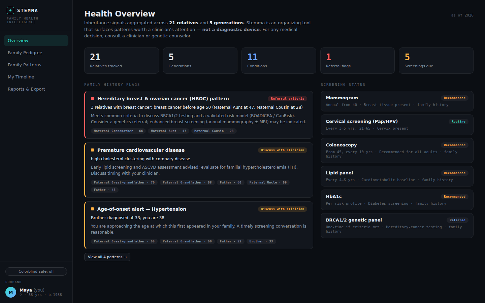
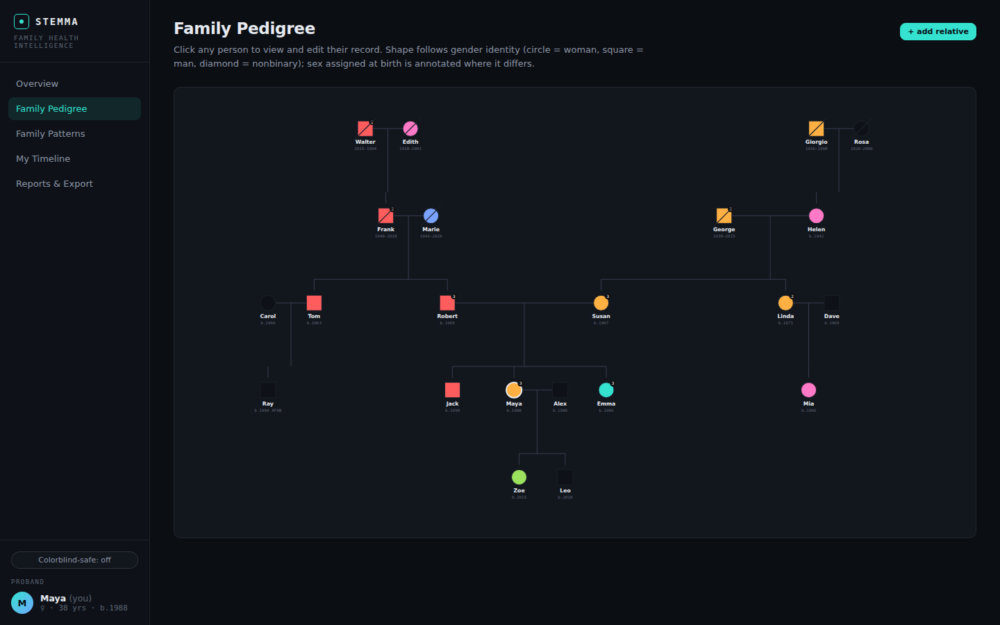
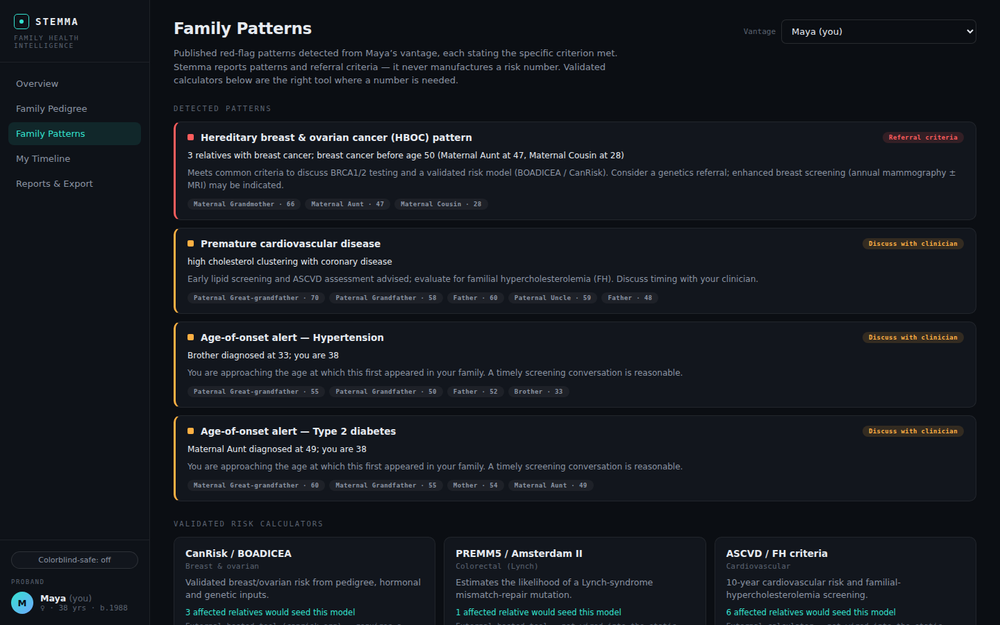

# Stemma

**Family health intelligence.**

[](https://github.com/kabaka/stemma/actions/workflows/ci.yml)
[](./LICENSE)
&nbsp;·&nbsp; [Live app](https://kabaka.github.io/stemma/)

Stemma is a **local-first** tool for recording your family's health history and surfacing the
hereditary patterns that are worth a clinician's attention. You build a pedigree of people —
each carrying their own conditions, ages of onset, and timeline — and Stemma reads that single
graph to detect published red-flag patterns (hereditary breast/ovarian cancer, Lynch syndrome,
premature cardiovascular disease, and more), tell you the *specific criterion* each one meets,
and suggest a genetics referral where the criteria warrant it. Your data never leaves your
browser.

> [!WARNING]
> **Stemma is not a medical device and does not diagnose.**
> It is a decision-*support* and organizing tool. Its pattern flags are heuristics derived from
> published clinical criteria — they are prompts to raise with a qualified professional, not a
> diagnosis, a risk score, or medical advice. Stemma deliberately **never manufactures a
> risk number**; it cites the criterion met and points you toward validated tools and a
> clinician. Always consult a genetic counselor or physician about your health.

> [!NOTE]
> **Project status.** Productionalized from the original **Lineage** prototype: the app is a
> real, tested, deployable React + TypeScript + Vite build. The domain engine, catalog,
> vocabulary adapter, store, all five views, the FHIR/Phenopacket/GEDCOM/SVG exports, and GEDCOM
> import are implemented and covered by the test suite. What's next lives in
> [`docs/ROADMAP.md`](docs/ROADMAP.md).

## Features

- **Gender-inclusive pedigree** — a three-generation family graph built on the 2022 NSGC
  standard: sex-assigned-at-birth drives the genetics and geometry, gender identity drives the
  display, and a per-person organ inventory drives screening.
- **Hereditary-pattern detection** — the engine flags published red-flag patterns (HBOC, Lynch,
  premature cardiovascular disease, autosomal-dominant vertical transmission, age-of-onset
  proximity, and a limited-history caveat), each stating the exact criterion met and an
  advisory next step — never a fabricated risk multiplier.
- **Personal + per-relative timelines** — every person carries their own dated events
  (diagnoses, medications, labs, screenings, immunizations, procedures, genetics), not just the
  proband.
- **Organ-inventory screening** — screening recommendations keyed off the organ inventory
  rather than gender (a trans man may still need cervical screening), escalated by family
  history, with pointers to validated external calculators (CanRisk, PREMM5, ASCVD).
- **Standards & interoperability** — export the same graph to FHIR R4, GA4GH Phenopackets v2,
  GEDCOM 5.5.1, and a 2022-nomenclature pedigree SVG, all generated client-side, so your record
  outlives the app. **GEDCOM import** seeds a pedigree from a family tree you already have (e.g.
  an Ancestry or FamilySearch export) — structural data only (people and the family graph; a
  genealogy file carries no health data, so conditions are still added in Stemma), parsed entirely
  in your browser.
- **Local-first & private** — the entire record lives in your browser's `localStorage`. Nothing
  is uploaded. The only runtime network call is the optional ICD-10 vocabulary lookup (below).

## Screenshots

| Health overview | Family pedigree | Hereditary patterns |
| --- | --- | --- |
|  |  |  |

## Quick start

Requires **Node.js ≥ 20**.

```bash
npm install      # install dependencies
npm run dev      # start the Vite dev server (http://localhost:5173)
npm run build    # type-check and produce a static production build in dist/
npm run preview  # serve the production build locally
```

The full quality gate — the same one CI runs — is:

```bash
npm run check    # format:check + lint + typecheck + test:run
```

## Tech stack

| Concern | Choice |
| --- | --- |
| UI | React 18 + TypeScript (strict) |
| Build / dev server | Vite 5 |
| State | Zustand (persisted to `localStorage`) |
| Tests | Vitest + Testing Library (jsdom) |
| Lint / format | ESLint 9 (flat config) + Prettier |
| Hosting | GitHub Pages — <https://kabaka.github.io/stemma/> |

## Project structure

```text
src/
├── domain/            # Pure, typed, unit-tested engine — no React, no I/O
│   ├── types.ts           # Core model: Person, Union, Condition, TimelineEvent, FamilyRecord
│   ├── person.ts          # Identity (sab/gender), organ inventory, condition access
│   ├── graph.ts           # Kinship math (coefficient of relatedness) + pedigree layout
│   ├── patterns.ts        # Hereditary red-flag detector (the core value)
│   ├── screening.ts       # Organ-inventory screening + external-calculator signals
│   ├── catalog.ts         # Condition lookup + ranked search over curated + long-tail
│   └── *.test.ts          # Co-located unit tests (graph, patterns, screening, catalog)
├── data/              # Curated, pure data tables (typed against domain)
│   ├── conditions.ts      # GENERATED — 116 curated conditions (do not hand-edit)
│   ├── categories.ts      # Clinical categories + default/colorblind palettes
│   ├── recommendations.ts # Curated per-condition advisory prompts
│   ├── events.ts          # Timeline event-type metadata
│   └── seed.ts            # Illustrative fictional 3-generation family (also used in tests)
├── integrations/      # Ports to external services
│   └── vocabulary.ts      # VocabularyProvider port + NLM Clinical Tables default
├── export/            # Standards serializers (client-side, with tests)
│   ├── fhir.ts            # HL7 FHIR R4 Bundle
│   ├── phenopacket.ts     # GA4GH Phenopacket v2
│   ├── gedcom.ts          # GEDCOM 5.5.1
│   └── pedigree-svg.ts    # 2022-nomenclature pedigree SVG
├── import/            # Standards parsers — the inverse of export/ (client-side, with tests)
│   └── gedcom.ts          # GEDCOM 5.5.1 → structural people + family graph (no conditions)
├── store/             # Application state
│   └── useStore.ts        # Zustand store + localStorage persistence + catalog builder
├── ui/                # React views + components
│   ├── App.tsx, Sidebar.tsx, hooks.ts
│   ├── views/             # Overview, Pedigree, Patterns, Timeline, Reports
│   └── components/        # FlagCard, PersonDrawer, ConditionPicker
├── styles/            # theme.css + components.css
└── main.tsx

scripts/gen-conditions.mjs   # Regenerates src/data/conditions.ts
```

## The two-layer condition model

Stemma is **not limited to a fixed condition list.** The catalog has two layers:

1. **Curated layer** — ~116 conditions in `src/data/conditions.ts`, *generated* by
   `scripts/gen-conditions.mjs`. These are the "conditions the engine understands": each carries
   the value-add metadata the pattern and screening logic reasons on — category, inheritance
   pattern, sourced prevalence + heritability, search synonyms — plus baked-in ICD-10-CM and
   SNOMED CT codes (72 of them) and 32 HPO terms. Regenerate it with `npm run gen:conditions`; never edit
   it by hand.
2. **Long-tail layer** — any of the ~74,000 ICD-10-CM codes, reached at runtime through the
   **vocabulary adapter** (`src/integrations/vocabulary.ts`). `VocabularyProvider` is a *port*;
   the default `NlmClinicalTablesProvider` calls the NLM Clinical Tables API, which is
   CORS-enabled and needs no API key — so long-tail search works straight from the static
   GitHub Pages build with **no backend**. Long-tail codes resolve to a generic catalog entry
   and are attached to a person like any curated condition.

## Data & privacy

- **Your data stays in your browser.** The whole record persists to `localStorage` (key
  `stemma-record`). There is no account, no server, and no upload.
- **Edit history keeps past snapshots on your device.** Stemma's append-only history (the
  **History** view) records a snapshot of your record before each change, under a separate
  `stemma-history` key. This means deleting a person, condition, or event removes it from your
  current record but **not** from the history log — use **Clear history** to purge those past
  snapshots from this device. The history is capped (most-recent changes only) and, like the
  record, is stored unencrypted at rest (below).
- **Stored unencrypted at rest.** Because the record lives in `localStorage`, it is held in
  plaintext in your browser profile — readable by anyone with access to your device/profile or by
  a malicious browser extension. Device security is your responsibility for now; an
  end-to-end-encrypted, zero-knowledge storage adapter is on the [roadmap](docs/ROADMAP.md) (§5).
- **One optional network call.** The only runtime request Stemma makes is the ICD-10 vocabulary
  lookup to the NLM Clinical Tables API — and only when you search for a long-tail condition.
- **No lock-in.** Everything is designed to export to open standards (below), because a personal
  health record should outlive the app that holds it.

## Standards & interoperability

Interoperability is a core design goal. The same underlying graph exports — entirely in the
browser — to:

- **HL7 FHIR R4** — `Patient`, `Condition`, and `FamilyMemberHistory`, dual-coded with SNOMED CT
  and ICD-10-CM, for patient portals and EHRs.
- **GA4GH Phenopackets v2** — the standard a genetic counselor or researcher can ingest directly.
- **GEDCOM 5.5.1** — genealogy interchange, and round-trippable: **import** reads the same format
  back in to seed a pedigree from a family tree exported by Ancestry, FamilySearch, Gramps, or
  Stemma itself. Import is **structural only** — people and the parent/child graph; a genealogy
  file carries no health data, so it never imports conditions — and runs entirely in your browser
  (`FileReader`, no upload).
- **Pedigree SVG** in correct 2022 NSGC nomenclature — the three-generation chart a counselor
  draws at intake.

Further import pipelines (FHIR pull, record OCR) are on the [roadmap](docs/ROADMAP.md) (§3).

## Roadmap & architecture

- [`docs/ROADMAP.md`](docs/ROADMAP.md) — where Stemma is headed.
- [`docs/ARCHITECTURE.md`](docs/ARCHITECTURE.md) — the layered architecture, data model, pattern
  engine, and the key design decisions (ADR log).
- [`CONTRIBUTING.md`](CONTRIBUTING.md) — conventions for (AI-assisted) development.

The product vision that drives all of the above is captured in
[`prototype/uploads/Lineage-expansion-ideation.md`](prototype/uploads/Lineage-expansion-ideation.md).

## License

[MIT](./LICENSE) © Stemma contributors.
