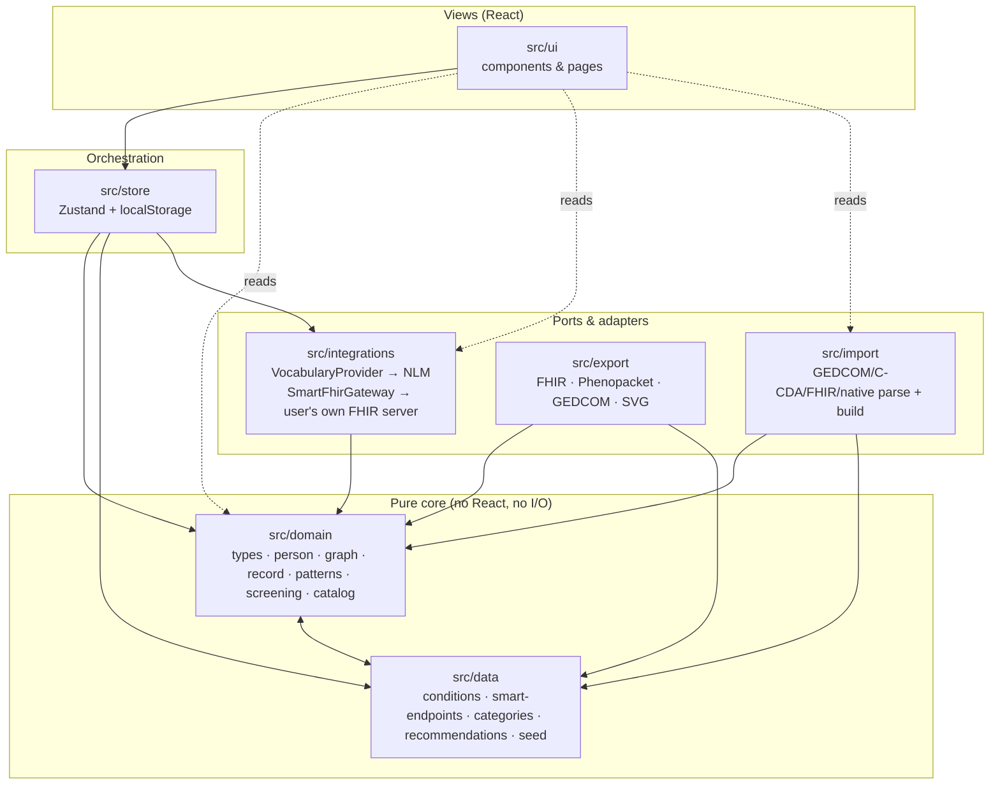

# Stemma — Architecture

This is the authoritative architecture reference for Stemma. It explains the layered design, the
"Person is the atom" data model, the kinship and hereditary-pattern engines, the two-layer condition
catalog, the local-first storage decision, and the key trade-offs — closing with an ADR-style
decision log.

The product vision behind these choices is
[`prototype/uploads/Lineage-expansion-ideation.md`](../prototype/uploads/Lineage-expansion-ideation.md)
(referred to below as "the ideation doc"; its section numbers, e.g. **§2**, are mirrored by
[`ROADMAP.md`](ROADMAP.md)).

## 1. What Stemma is — and the boundary it holds

Stemma is **decision support, not a diagnostic device.** It records a family's health history and
surfaces hereditary patterns worth a clinician's attention. Two boundaries are architectural, not
cosmetic, and are enforced in the domain layer:

- It **detects published red-flag patterns and cites the criterion met** — it does **not** compute a
  risk number (see [§5](#5-the-hereditary-pattern-engine) and [ADR-004](#adr-004--detect-patterns-do-not-manufacture-a-risk-number)).
- All output is **advisory / referral-oriented** — prompts to take to a professional, never a
  diagnosis or instruction.

## 2. Layered architecture

Stemma is a layered, local-first single-page app. Dependencies point **inward**: the domain core
knows nothing about React, storage, or the network; outer layers orchestrate the core.



| Layer | Directory | Responsibility | Depends on |
| --- | --- | --- | --- |
| **Domain** | `src/domain/` | Pure, typed, tested engine: model, kinship math, pattern detection, screening, catalog search, partial-date parsing/formatting (`dates.ts`) | itself + curated `data` tables |
| **Data** | `src/data/` | Curated, pure constants (catalog, the SMART-on-FHIR provider directory in `smart-endpoints.ts`, categories, recommendations, seed family, FHIR terminology constants in `fhir-codes.ts`) | `domain` (types only) |
| **Integrations** | `src/integrations/` | Ports to external services: the vocabulary adapter, and the SMART-on-FHIR OAuth2+PKCE transport (`src/integrations/smart-fhir/`) | `domain` (types) |
| **Export** | `src/export/` | Serialize the graph to open standards | `domain`, `data` |
| **Import** | `src/import/` | Parse an external file/bundle into the graph (the inverse of Export) | `domain`, `data` |
| **Store** | `src/store/` | Zustand state, mutations, `localStorage` persistence, catalog assembly | `domain`, `data`, `integrations` |
| **UI** | `src/ui/` | React views over the store; the one layer allowed to read build-time env (`src/ui/config.ts`) | everything below |

> **Current state.** All layers are implemented; the domain, store, export, import, and view layers
> are covered by the test suite (1,170 tests). The `@/` path alias maps to `src/` (see `vite.config.ts`
> / `tsconfig.app.json`).

The pure core is genuinely pure: `src/domain` imports no React, performs no I/O (`fetch`,
`localStorage`, timers), and imports nothing from `store`/`ui`/`integrations`. The only cross-layer
value it reads is the curated `RECS` table from `src/data/recommendations.ts` (a constant, not I/O).
`src/data` types itself against `src/domain` but holds no logic — hence the two are drawn as one
mutually-referencing pure core.

## 3. Data model — Person is the atom

The foundational decision (ideation **§1**) is that the **Person is the core entity, not the
proband.** Every surface — pedigree, patterns, timeline, screening — is a *view* over one graph:
people, the typed relationship edges between them (`Union`), the conditions each person carries, and
their timeline events. This is what lets every relative carry their own conditions and onset ages,
and lets any computation be **re-rooted on any person** in the record.

The model lives in [`src/domain/types.ts`](../src/domain/types.ts):

```ts
type PartialDate = string; // ISO-8601 "YYYY" | "YYYY-MM" | "YYYY-MM-DD" — exactly the source's precision

interface Coding {                // a controlled-vocabulary code, attached verbatim at import
  system: string; code: string; display?: string;
}

interface Person {
  id: string;
  name: string;
  sab: 'm' | 'f' | 'u' | 'x';     // sex assigned at birth — drives genetics + geometry
  gender: 'man' | 'woman' | 'nb'; // gender identity — drives display only
  pronouns?: string;
  organs?: Organ[];               // explicit organ inventory; else derived from `sab`
  gen: number;                    // generation index (lower = older)
  x: number;                      // horizontal layout hint
  dead: boolean;
  birth: number | null;
  birthDate?: PartialDate;        // precise echo of `birth`; year component must match
  death: number | null;
  deathDate?: PartialDate;        // precise echo of `death`; year component must match
  conds: ConditionEntry[];        // { id, onset: number | null, prov, onsetDate?: PartialDate }
  isProband?: boolean;
}

interface Union {                 // a typed relationship edge
  parents: string[];
  children: string[];
  consanguineous?: boolean;       // blood-related partners — changes recessive risk
  twins?: TwinSet[];              // multiple-birth groups among `children`
}

interface TimelineEvent {         // one dated event owned by a person
  id: string; person: string; year: number;
  date?: PartialDate;             // precise echo of `year`; year component must match
  type: 'immunization'|'visit'|'lab'|'diagnosis'|'medication'|'screening'|'procedure'|'genetic'|'allergy'|'vital';
  title: string; detail: string;
  prov?: Provenance;              // defaults to 'self' when absent (`eventProv`)
  coding?: Coding[];               // controlled-vocabulary codes, preserved verbatim at import
  // + type-specific structured payloads: med / lab / vital / allergy / immunization
}

interface FamilyRecord {          // the single graph every view reads
  people: Person[];
  unions: Union[];
  timeline: TimelineEvent[];
  probandId: string;
}
```

`Coding` and `PartialDate` (DR-0023/DR-0024) are additive, source-agnostic carriers introduced for
the full-timeline SMART-on-FHIR import (see [ADR-011](#adr-011--full-timeline-smart-on-fhir-import-and-the-partialdate--coding--event-provenance-uplift))
but usable by any import/entry path: `PartialDate` preserves whatever date precision a source
actually gave (never fabricating a day/month it didn't), and `Coding` preserves a controlled
vocabulary code (RxNorm/CVX/LOINC/SNOMED CT/ICD-10-CM) verbatim rather than dropping it. Both are
optional, higher-precision *echoes* of an always-present coarse field (`year`/`birth`/`death`) —
existing consumers that only read the coarse field are unaffected.

### Gender-inclusive by construction (2022 NSGC)

Per the 2022 NSGC standard (ideation **§5**), Stemma separates three concerns that legacy pedigree
tools conflate:

| Concern | Field | Drives |
| --- | --- | --- |
| Sex assigned at birth | `sab` | Genetics and pedigree geometry |
| Gender identity | `gender` (+ `pronouns`) | Display: symbol and relationship label |
| Anatomy present | `organs` (or derived) | Screening recommendations |

The clinical payoff falls out of the model: screening is keyed off the **organ inventory**, not
gender — a trans man may still need cervical screening, a trans woman prostate screening. When
`organs` is omitted, `defaultOrgans(sab)` supplies a default set; set it explicitly to model
surgical history. The seed family's `ray` (AFAB, gender man, explicit `['ovaries','uterus','cervix']`
inventory) exercises exactly this path — and is labeled an *uncle*, not an aunt, because the label
follows gender identity while the geometry follows `sab`.

## 4. Kinship and the coefficient of relatedness

All family-graph queries and kinship math live in [`src/domain/graph.ts`](../src/domain/graph.ts) and
are pure over a `FamilyRecord`. `relationInfo(idx, id, rootId)` computes the relationship of any
person to any vantage `rootId`:

1. Collect the ancestors of both `id` and `rootId` with their shortest generational distance
   (`ancestors`, a shortest-distance DFS so multiple paths collapse to the closest).
2. Find the **most-recent common ancestors** (MRCAs): common ancestors none of whose children are
   also common.
3. Sum a **coefficient of relatedness** `r = Σ 0.5^(depth_root(a) + depth_id(a))` over the MRCAs —
   the probability of sharing a given allele IBD.
4. **Bin** `r` into a degree: `r ≥ 0.4 → 1st`, `≥ 0.2 → 2nd`, `≥ 0.09 → 3rd`, else non-blood
   (`null`).
5. Derive the side (`Paternal`/`Maternal`, from the root's own father/mother ancestor sets) and a
   human-readable label from the generation delta and the person's gender identity.

Because the vantage is a parameter, risk and screening can be recomputed from any member's point of
view within one record (`store.riskRoot`). `computeLayout` / `segments` in the same module turn the
graph into a generation-banded pedigree layout whose connector lines follow the standardized (2022
NSGC / Bennett) conventions: a **relationship line** between partners, a **sibship line** that spans
*only* a union's own children, and a **line of descent** from the relationship midpoint (or, for a
partner not in the record, straight from the single parent). That descent is a plain vertical when it
sits above the sibship and a lane-separated orthogonal jog when the sibship is pushed off-centre, so
two unions' lines never merge — a half-sibling never reads as the visible couple's child.

## 5. The hereditary-pattern engine

[`src/domain/patterns.ts`](../src/domain/patterns.ts) is Stemma's core value. `detectPatterns(record,
catalog, rootId, asOfYear)` walks the blood relatives of `rootId` and emits `PatternFlag`s, each
carrying a `severity`, the **specific `criterion` met**, an **advisory `rec`**, and the contributing
relatives. Flags sort most-actionable first (`referral` → `discuss` → `note`).

| Pattern | Trigger (summary) | Severity |
| --- | --- | --- |
| Hereditary breast & ovarian cancer (HBOC) | ≥2 breast ca on the **same lineage** (NCCN per-side), and/or ovarian ca, and/or breast ca < 50 | referral (discuss if the sides aren't recorded) |
| Lynch syndrome (colorectal & spectrum) | colorectal < 50, or ≥2 Lynch-spectrum cancers (colorectal / endometrial / gastric / ovarian / upper-urinary-tract) | referral |
| Premature cardiovascular disease | coronary disease in a 1st-degree relative (M<55/F<65), or cholesterol clustering with CAD | referral / discuss |
| Autosomal-dominant vertical transmission | a dominant-pattern condition across ≥2 generations or in a 1st-degree relative | referral / discuss |
| Age-of-onset proximity | vantage age approaches the earliest family onset of a condition they don't yet have | discuss |
| Limited family history | fewer than 4 blood relatives on record | note |

A second surface, `familyFindings`, produces the per-condition "Family Patterns" table, banding each
condition (`Diagnosed` / `Clustered` / `Close family` / `In family`) and attaching a curated or
generic advisory line.

### The "no manufactured number" boundary

The prototype computed `RR = 1 + (Σ degree-weights) × sensitivity`. That was retired deliberately
(ideation **§2**): a bare multiplier ignores base rate, inheritance pattern, family size, and age,
and "2× a 0.5% risk" reads as authoritative while being noise. Stemma instead **states the criterion
met** and, where a real number is warranted, points at a **validated external calculator** rather
than inventing one. `src/domain/screening.ts` encodes those pointers (`CALCULATOR_DEFS`: CanRisk /
BOADICEA, PREMM5 / Amsterdam II, ASCVD / FH) and is explicit that they are external tools "not wired
into the static build." See [ADR-004](#adr-004--detect-patterns-do-not-manufacture-a-risk-number).

## 6. The two-layer catalog and the vocabulary port

A condition is either **curated** (the engine understands it) or **long-tail** (a raw ICD-10 code),
and the app is never limited to the curated set.

### Curated layer
[`src/data/conditions.ts`](../src/data/conditions.ts) holds **116 curated conditions**, each with the
value-add metadata the engine reasons on (`cat`, `pattern`, `base` prevalence, `syn` synonyms) plus
baked-in ICD-10-CM and SNOMED CT codes (**72** coded) and **32 HPO** terms for the genetics audience.
It is **generated** by [`scripts/gen-conditions.mjs`](../scripts/gen-conditions.mjs) from the base
catalog (`scripts/conditions.source.json`) and its verified code + epidemiology maps, and carries a
`DO NOT EDIT BY HAND` banner — regenerate with `npm run gen:conditions`. The high-signal set's
prevalence is bound to sourced epidemiology (CDC / SEER / NHANES / AHA / IHME) with a `prevSource`
citation and a cited heritability (`herit`); the long tail stays illustrative until later passes
(ideation **§3**). `base` and `herit` are catalog metadata only — never rendered as a person's risk
(the "no manufactured number" boundary applies to heritability just as to risk).

### Long-tail layer — the vocabulary port
The ~74,000-code ICD-10-CM long tail is reached at runtime through a **port**,
[`src/integrations/vocabulary.ts`](../src/integrations/vocabulary.ts):

```ts
interface VocabularyProvider {
  readonly name: string;   // shown in the UI
  readonly system: string; // e.g. 'ICD-10-CM'
  search(query: string, opts?: VocabularySearchOptions): Promise<VocabularyHit[]>;
}
// VocabularyHit = { code: string; name: string; system: string }
```

The default `NlmClinicalTablesProvider` calls the **NLM Clinical Table Search Service**. That choice
is what keeps Stemma a **backend-free static site**: the NLM endpoint is **CORS-enabled and needs no
API key**, so long-tail lookup works directly from the browser on GitHub Pages — no server, no proxy,
no secret to leak. A hit is turned into a generic `Condition` via `hitToCondition` and attached to a
person like any curated one; `catalog.get()` resolves curated and long-tail ids uniformly (unknown
ids fall back to a generic record), so the rest of the engine treats them the same.

Because the provider is a port, a self-hosted deployment can implement the same interface against a
fuller terminology server (SNOMED/UMLS, a FHIR `$expand`) without touching the domain or UI (ideation
**§3**).

The store assembles the working catalog by merging the curated list with the user's long-tail
extensions: `buildCatalog(extensions)` → `createCatalog([...CONDITIONS, ...extensions], …)` in
[`src/domain/catalog.ts`](../src/domain/catalog.ts).

## 7. Local-first storage — and the pluggable future

Stemma is **local-first** (ideation **§8**, "storage adapter #1"). The Zustand store
([`src/store/useStore.ts`](../src/store/useStore.ts)) persists via `zustand/middleware`'s `persist` to
`localStorage` under the key `stemma-record`. Persistence is **partialized** to the durable data —
the `FamilyRecord`, long-tail catalog `extensions`, and `palette` — while transient UI state (current
view, selection, vantage) is deliberately not persisted. Mutations clone the record
(`structuredClone`) and set immutably. On hydrate, a `merge`/`migrate` guard validates the persisted
blob's shape and falls back to a clean seed if it is corrupt or schema-outdated, so the durable asset
can't hydrate garbage into state.

This is the cleanest privacy story: the record never leaves the browser, and every runtime network
call is opt-in and user-triggered — the optional NLM vocabulary lookup, and, only if the user
connects one, the SMART-on-FHIR sync to a provider endpoint the user names (never a Stemma server;
see [§9](#9-the-import-layer) and [ADR-010](#adr-010--client-side-smart-on-fhir-import-supersedes-adr-009s-live-pull-deferral)).
**Caveat — unencrypted at rest:** because it lives in
`localStorage`, the record is stored in plaintext in the browser profile (readable with device/profile
access or by a malicious extension). At-rest encryption is deferred to the roadmap's storage adapter #2
(end-to-end-encrypted, zero-knowledge); the local build's threat model assumes a trusted device. The ideation doc's **§8** describes the intended
evolution — a **pluggable storage/sync layer** with a second adapter (a self-hosted, end-to-end
encrypted, per-person-vault API) behind the *same* UI and export layer, so moving between a
GitHub-Pages local build and a self-hosted deployment is not a rewrite. Today only the local adapter
exists (implicitly, as the `persist` config); factoring it behind an explicit interface is roadmap
work.

## 8. The export layer

No lock-in is treated as an ethical requirement for a personal health record (ideation **§4** / **§9**):
the same graph exports to open standards so it outlives the app. The `src/export/` layer reads a
`FamilyRecord` (+ catalog) and emits — entirely client-side:

- **HL7 FHIR R4** bundles (`Patient`, `Condition`, `FamilyMemberHistory`), dual-coded with SNOMED CT
  and ICD-10-CM, for portals/EHRs;
- **GA4GH Phenopackets v2** for genetic counselors and research;
- **GEDCOM 5.5.1** for genealogy interchange — round-trippable, since `src/import/` (below) reads
  it back;
- a **three-generation pedigree SVG** in 2022 NSGC nomenclature.

Like every layer below the store, export modules must be pure and deterministic (see
[§10](#10-determinism)) and depend only on `domain`/`data`.

## 9. The import layer

Phase 3 of the roadmap ("kill the retyping") added `src/import/`, the inverse of `src/export/` and
built to the same contract: it depends only on `domain`/`data`, never `store`/`ui`, and is pure and
deterministic — no clock, no random ids, no network — so a file dropped in by a user is parsed
entirely client-side.

[`src/import/gedcom.ts`](../src/import/gedcom.ts) exposes two functions (re-exported from
`src/import/index.ts`):

- **`parseGedcom(text)`** — a tolerant, hand-written GEDCOM 5.5.1 parser (no new runtime dependency).
  It builds the level-nested record tree, then reads `INDI` records into structural individuals
  (`NAME` with the `/surname/` slashes cleaned, `SEX`→`sab`, `BIRT`/`DEAT` year extracted from
  whichever GEDCOM date form is present) and `FAM` records into parent/child families. It never
  throws — a BOM, CRLF/CR line endings, dangling family links, duplicate cross-references, and an
  empty file all degrade to `warnings` surfaced to the user rather than a failure.
- **`buildRecordFromGedcom(parsed, probandId?)`** — maps the parsed structure to a `FamilyRecord`,
  or `null` when there is nothing to import. GEDCOM has no concept of "the record owner," so the
  caller supplies `probandId`; the UI ([`GedcomImport.tsx`](../src/ui/components/GedcomImport.tsx))
  asks "which of these is you?" and defaults to the first individual in the file.

**Scope is deliberately structural, not clinical.** Only people (name, `sab`, birth/death years) and
the union graph import — every person is built with `conds: []`. A genealogy export carries no
structured health data, and inferring conditions from free-text `NOTE`s would misattribute clinical
facts to a person who never entered them, so conditions are always added in Stemma after import.
`SEX` maps to `sab` (genetics/geometry); the display `gender` is *defaulted* from `sab` via
`genderFromSab` and stays freely editable per person afterwards — the same 2022 NSGC
genetics/identity split the rest of the model holds to (see [§3](#3-data-model--person-is-the-atom)).
Because the graph is **genetic** parentage, a step / adopted / foster relationship is not imported as
a parent edge — otherwise a step-parent would surface as a blood relative in the kinship math. This is
resolved **per parent**: Ancestry's `_FREL` (to father) / `_MREL` (to mother) and the standard
child-level `PEDI` (from either the `CHIL` sub-tag or the individual's `FAMC`) are each read, so a
child who is step to one parent but biological to the other keeps only the biological edge — a `FAM`
can therefore yield the couple's union plus a single-parent union for that child. Ancestry's
non-committal `unknown` is treated as genetic (its default for an unspecified-but-biological link).

GEDCOM also carries no layout, so two new domain functions in
[`src/domain/record.ts`](../src/domain/record.ts) derive one from the graph alone:

- **`deriveGenerations(people, unions)`** — assigns a generation index to every person with a
  cycle-safe, signed-delta breadth-first search (a child is one generation below each parent,
  partners and siblings share a generation), normalized so the oldest generation present is `0`.
  First assignment wins, so a contradictory cycle in malformed data degrades gracefully instead of
  looping.
- **`layoutFromGraph(record)`** — assigns `gen` (via `deriveGenerations`) and a _seed_ `x` per
  person, ordering each generation by the barycentre of its already-placed parents. `gen` is
  authoritative and used throughout the app; the `x` is only a starting order. The real horizontal
  placement lives at render time in **`computeLayout`** ([`src/domain/graph.ts`](../src/domain/graph.ts)):
  it bands by the authoritative `gen`, then runs a barycentre ordering pass (keeping couples adjacent)
  and an isotonic-regression coordinate pass so children sit centred under their parents and partners
  sit side by side. Doing the placement at render time fixes every record source uniformly — the
  hand-authored seed, `layoutFromGraph`'s import output, and `linkRelative`'s local guesses all carry
  only a partial `x` hint. `computeLayout` never re-derives `gen`, and its output is a `useMemo`-cached
  view value that is never written back into the durable record.

Because an imported record is the first thing fed to the store from outside its own trusted
mutation path, `store.replaceRecord` now validates it against `isValidRecord` (moved to
`src/domain/record.ts`) before swapping it in, rejecting a malformed record rather than hydrating
garbage into state — the same guard `localStorage` hydration already applied. See
[ADR-008](#adr-008--gedcom-import-is-structural-only-via-a-new-import-layer).

**C-CDA and FHIR both import clinical facts (conditions + family history), not just structure**,
and both go through **merge-with-review** rather than a structural replace — see
[ADR-009](#adr-009--c-cda-import-is-merge-with-review-relationship-placement-is-conservative-by-construction)
for the C-CDA importer (`src/import/ccda.ts`). [`src/import/fhir.ts`](../src/import/fhir.ts)'s
**`parseFhirImport(bundle, {patientId})`** is the FHIR R4 counterpart: a pure mapping of a
`Bundle` into the same source-agnostic parsed shape, so both importers share one
reconciliation/merge engine — [`src/import/health-record.ts`](../src/import/health-record.ts),
hoisted out of `ccda.ts` for this purpose (`stageHealthRecordImport` → review →
`applyHealthRecordImport`; `ccda.ts` re-exports the same functions under its established
`stageCcdaImport`/`applyCcdaImport` names, so its own test oracle stays a byte-for-byte regression
check across the hoist). `parseFhirImport` itself never touches the network — the bundle it reads
comes from the impure [`src/integrations/smart-fhir/`](../src/integrations/smart-fhir/) transport
(discovery, OAuth2 + PKCE token exchange, paginated search), which
[`src/store/useSmartConnectionStore.ts`](../src/store/useSmartConnectionStore.ts) is the only code
path that drives — but the store's `syncNow` returns that **raw `FhirImportBundle`** rather than
a parsed record; parsing (`parseFhirImport`) and staging (`stageHealthRecordImport`) happen in
[`SmartFhirConnect.tsx`](../src/ui/components/SmartFhirConnect.tsx), the UI layer, exactly where
the C-CDA importer already does the equivalent `parseCcda`/`stageCcdaImport` work. The store's
only outbound dependency stays `domain`/`data`/`integrations` — it never imports `src/import/`.
See [ADR-010](#adr-010--client-side-smart-on-fhir-import-supersedes-adr-009s-live-pull-deferral)
for the original design and
[ADR-011](#adr-011--full-timeline-smart-on-fhir-import-and-the-partialdate--coding--event-provenance-uplift)
for the full-timeline expansion below.

**FHIR now imports the full clinical timeline, not just `Condition`/`FamilyMemberHistory`**
(DR-0023/DR-0024). Alongside the proband's problems and relatives, `parseFhirImport` maps
`MedicationStatement`/`MedicationRequest`, `Observation` (laboratory, vital-signs, and genomic —
each identified by `category` or, for genomic, a known genetic LOINC code from
[`src/data/fhir-codes.ts`](../src/data/fhir-codes.ts)), `Immunization`, `AllergyIntolerance`,
`Procedure`, and `Encounter` into `ParsedEvent`s — a source-agnostic sibling of `ProblemEntry` that
`src/import/health-record.ts` stages (`stageEvent`, dedup by a deterministic
`"fhir:<ResourceType>:<id>"` `parseId`) and applies into `FamilyRecord.timeline` with
`prov: 'record'`, exactly like a condition. Every mapper honors the same status-gating and
absence-handling contract `Condition`/`FamilyMemberHistory` already established (§ "How statuses
and absences are handled" in [`SMART-ON-FHIR.md`](./SMART-ON-FHIR.md)): `entered-in-error` is
dropped silently, an explicit absence (`not-done`/`not-taken`/`refuted`/`cancelled`) is dropped and
counted in a warning rather than staged, an uncertain/interim status is staged but defaulted off,
and a resource with no usable date is dropped and counted rather than assigned a fabricated year. A
genomic `Observation` is deliberately **fact-of-test only** — the parser never reads its
`value[x]`/`interpretation`/`component` — and, like `Encounter`, is always staged needs-review
regardless of status, so nothing from either resource type is ever pre-selected. `gateway.ts`
fetches the expanded resource set with one search per type via `Promise.all`; a single failing
search degrades to a `fetchWarnings` entry (surfaced to the user) instead of aborting the sync — the
mandatory `Patient` read is the only fetch that still fails closed.

### The build-time env seam, the provider picker, and its generated directory (DR-0027)

Connecting to a provider no longer requires hand-entering OAuth values, and now spans **both Epic
and Oracle Health (Cerner)** through one unified picker. Three pieces, each landing in the layer
the layering table already prescribes:

- **`src/ui/config.ts`** is the *only* place in the app that reads `import.meta.env` — a Vite/build
  concern the layering table restricts to the UI layer. `buildTimeClientId(vendor: SmartVendor)`
  takes the vendor the user's chosen provider belongs to and returns the matching client ID: Epic's
  `VITE_EPIC_CLIENT_ID` (falling back to the legacy `VITE_SMART_CLIENT_ID` alias) or Cerner's
  `VITE_CERNER_CLIENT_ID`, both baked in by
  [`.github/workflows/deploy.yml`](../.github/workflows/deploy.yml) from GitHub Actions repository
  **Variables** (`vars.EPIC_CLIENT_ID` / legacy `vars.SMART_CLIENT_ID`, and `vars.CERNER_CLIENT_ID`
  — not Secrets, since a public-client `client_id` isn't confidential, RFC 6749 §2.1), or `null` per
  vendor when its Variable is unset. Epic and Oracle Health are separate app registrations, so the
  id is resolved **per vendor**, not once globally — one Epic id covers every Epic organization, one
  Cerner id covers every Oracle Health tenant. The value flows straight into the existing
  `beginConnect(baseUrl, clientId, opts)` call; neither `src/store/` nor `src/integrations/` gained
  a new dependency. When a vendor's id is `null` (its Variable unset, a fork, or local dev),
  `SmartFhirConnect` renders the manual **Client ID** field for providers of that vendor only —
  picking an Epic provider in a build where only Cerner is configured (or vice versa) reveals it.
- **`src/data/smart-endpoints.ts`** is a second **generated, do-not-hand-edit** data table
  alongside `conditions.ts` — same contract: pure, typed against `domain` only, regenerate rather
  than edit. [`scripts/gen-endpoints.mjs`](../scripts/gen-endpoints.mjs) (`npm run gen:endpoints`)
  now merges **two** sources: Epic's published "User-access Brands" FHIR bundle, slimmed to a
  brand-level index, and Oracle Health / Cerner's `ignite-endpoints` patient endpoint list
  (`millennium_patient_r4_endpoints.json`), which is already per-facility so needs no brand
  collapsing. Every entry carries a `source: 'epic' | 'cerner'` tag (the `SmartVendor` type) driving
  both the per-vendor client-id lookup above and an inline system label in the picker. The merged,
  deduplicated, sorted directory is **2,566 entries** (~1,243 Epic + ~1,323 Cerner) with a compact
  interned-URL encoding to keep the committed file small (~292 KB raw / ~84 KB gzip). Oracle
  Health's public sandbox tenant is excluded so patients never see a non-production endpoint in the
  picker. Unlike `gen-conditions.mjs`, there is **no CI staleness gate** for either source —
  re-fetching Epic's ~92 MB bundle on every CI run isn't proportionate, and Oracle Health publishes
  no fixed refresh cadence for its endpoint list (watched instead via the
  `oracle-samples/ignite-endpoints` repository's git history) — so freshness is a documented manual
  cadence (see
  [`SMART-ON-FHIR.md`](./SMART-ON-FHIR.md#maintainer-setup--connecting-shared-epic-and-cerner-apps));
  `tsc` still enforces the generated file's shape via the picker's typed import. The directory is
  **built into the app, never fetched at runtime** — preserving local-first exactly as the curated
  catalog does.
- **`ProviderPicker.tsx`** (renamed from `EpicBrandPicker.tsx` when Cerner support landed), the
  searchable combobox over that directory, is **lazy-loaded** (`React.lazy` + dynamic
  `import('@/data/smart-endpoints')`) from `SmartFhirConnect.tsx` so neither the component nor the
  provider table touch the app's critical-path bundle — the cost is paid only once someone opens
  the connect panel. Search is deliberately **unified across both vendors** — there is no
  Epic-vs-Cerner toggle; each result simply discloses its own system ("Epic" / "Oracle Health")
  inline via a small `VENDOR_LABEL` lookup keyed on the row's `source`, folded into the option's
  accessible name so a screen reader announces it too. A manual FHIR-endpoint field remains as an
  explicit fallback (a provider not in the directory), reusing the same `beginConnect` call the
  picker's `onSelect` does.

The redirect URI is no longer a form field either: `SmartFhirConnect`'s `redirectUri()` still
computes `window.location.origin + import.meta.env.BASE_URL` (unchanged since ADR-010) and passes
it to `beginConnect`, but both vendors fix redirect URIs at app-registration time — an out-of-band,
one-time step for whoever registers the app, not a per-user runtime concern — so displaying it to
every visitor was misleading rather than merely informational.

**Closing the "redirected home, nothing happened" gap.** `useSmartConnectionStore` gained a small,
non-persisted signal, `requestedSyncId: string | null` (plus `requestSync`/`clearRequestedSync`),
following the exact idiom the store's existing `callbackError` field already established for the
failure path. On a successful OAuth callback the store sets `requestedSyncId` to the new
connection's id in the same atomic `set` that adds the connection; `App.tsx` — the one legal
mediator between the record store and the SMART connection store — navigates to the pedigree once
(gated by its existing `smartCallbackFired` latch); `PedigreeView` opens the connect panel on the
signal; `SmartFhirConnect` auto-fires its own existing `handleSync` exactly once, clearing the
signal synchronously before the first `await` (mirroring the store's `callbackInFlight` discipline
against React 18 StrictMode's dev double-invoke). The same signal powers re-sync: `SmartSyncChip.tsx`,
a small unobtrusive chip in `Sidebar.tsx`'s foot (rendered only when at least one connection exists),
calls `requestSync(mostStaleId)` on click — no duplicated sync-and-open-panel logic anywhere. No new
store↔UI dependency was introduced; `requestedSyncId` is plain data, like `callbackError` before it.

## 10. Determinism

The engine is deterministic so it can be unit-tested against known pedigrees. The one source of
non-determinism — the current date — is **injected, never read** inside the domain:

- Any domain function that reasons about age takes an explicit **`asOfYear`** parameter
  (`detectPatterns(…, asOfYear)`, `ageOf(person, asOfYear)`); timeline events carry explicit years.
- The **wall-clock binding lives only in the store**: `CURRENT_YEAR = new Date().getFullYear()`,
  passed in at call time.
- **Tests pass fixed values** (`const AS_OF = 2026`) and assert against them — never against
  `new Date()`. See [`patterns.test.ts`](../src/domain/patterns.test.ts) and
  [`graph.test.ts`](../src/domain/graph.test.ts).

Tests are Vitest + Testing Library (jsdom), co-located as `*.test.ts`, and generally use the seed
family in [`src/data/seed.ts`](../src/data/seed.ts) as their fixture (`npm run test` / `test:run`).

## 11. Decisions (ADR log)

Lightweight architecture decision records. Each: context → decision → consequence.

### ADR-001 — React 18 + Vite 5 + TypeScript (strict)
**Context:** productionalizing a single-file prototype into a maintainable static SPA.
**Decision:** React 18 + TypeScript in `strict` mode, built with Vite 5; oxlint (type-aware) +
Prettier; Vitest for tests. **Consequence:** fast dev/build, a typed model that documents itself, and
a single quality gate (`npm run check`). `verbatimModuleSyntax` mandates `import type`; `base` is set
to `/stemma/` for GitHub Pages builds.

### ADR-002 — Zustand for state, local-first persistence
**Context:** one family record, re-rootable views, no backend. **Decision:** a single Zustand store
with `persist` to `localStorage`, partialized to durable data. **Consequence:** minimal boilerplate,
trivial persistence, and a clean privacy story — at the cost of `localStorage`'s size/quota limits,
which the pluggable storage layer (ideation §8) will address (IndexedDB/OPFS, or a self-hosted vault).

### ADR-003 — Local-first, no backend (yet)
**Context:** a family health record is sensitive; the simplest trustworthy deployment is one that
cannot leak. **Decision:** ship a static site whose data never leaves the browser; every runtime
network call is opt-in and user-triggered — the key-less, CORS-safe NLM vocabulary lookup, and,
since [ADR-010](#adr-010--client-side-smart-on-fhir-import-supersedes-adr-009s-live-pull-deferral),
a SMART-on-FHIR sync against a provider endpoint the user names. **Consequence:** no server to
run, breach, or fund; interoperability and multi-device sync are deferred to the export layer and a
future encrypted self-hosted adapter (ideation §7–§8) behind the same UI.

### ADR-004 — Detect patterns, do not manufacture a risk number
**Context:** the prototype's homemade relative-risk multiplier ignored base rate, inheritance pattern,
family size, and age, yet read as authoritative. **Decision:** retire the number; detect published
red-flag patterns, cite the specific criterion met, and defer real quantification to validated
external calculators. **Consequence:** defensible, more clinically useful output and a clean liability
boundary; Stemma stays decision-*support*, not a diagnostic device. (ideation §2.) This is enforced as
a code-review invariant — see [`CONTRIBUTING.md`](../CONTRIBUTING.md).

### ADR-005 — Two-layer condition catalog with a vocabulary port
**Context:** a curated catalog rich enough for the engine to reason on, without capping the app at a
fixed list. **Decision:** a generated curated layer (116 conditions with category / inheritance /
sourced prevalence / codes) plus a runtime `VocabularyProvider` port (default: NLM Clinical Tables) for the
~74,000-code ICD-10 long tail. **Consequence:** high-signal reasoning where it matters, full ICD-10
coverage everywhere else, and no backend or API key required for the static build. The curated file is
generated (`npm run gen:conditions`), never hand-edited. (ideation §3.)

### ADR-006 — Person is the atom; gender-inclusive (2022 NSGC)
**Context:** the prototype blended a proband-centric risk tool with a personal tracker.
**Decision:** model the Person as the core entity and make every surface a view over one
people-and-unions graph; adopt the 2022 NSGC split of `sab` (genetics/geometry) / gender identity
(display) / organ inventory (screening). **Consequence:** every relative carries their own history,
computations re-root on any vantage, and screening is anatomy-correct for trans and nonbinary
individuals — a genuine differentiator. It is the one schema choice that is expensive to reverse, so
it was made first. (ideation §1, §5.)

### ADR-007 — Name: Stemma
**Context:** the prototype was codenamed **Lineage**. **Decision:** the productionalized project is
**Stemma** (repo `kabaka/stemma`), tagline *"Family health intelligence."* **Consequence:** a
*stemma* is a family tree / lineage diagram — fitting for a pedigree-first tool; the `Lineage`
prototype artifacts remain under `prototype/` as source material and are referenced (as `LINEAGE_*`)
by the catalog generator.

### ADR-008 — GEDCOM import is structural-only, via a new import layer
**Context:** Phase 3 ("kill the retyping") called for reusing an existing family tree instead of
retyping every relative. A GEDCOM file describes people and genealogical relationships; it has no
field for a health condition, and its free-text `NOTE`s are not structured clinical data — parsing
them into `Condition`s would mean guessing at a diagnosis from prose the engine cannot verify.
**Decision:** add `src/import/` as a new layer, the inverse of `src/export/` and bound to the same
contract (depends on `domain`/`data` only, pure, deterministic, no network). `parseGedcom` +
`buildRecordFromGedcom` import people and the parent/child graph only — every imported person gets
`conds: []`, and conditions are entered in Stemma afterward. GEDCOM's `SEX` sets `sab`; the display
`gender` defaults from it and stays editable, and GEDCOM's missing proband concept is resolved by
asking the user "which of these is you?" in the UI. Generations and layout, absent from GEDCOM
entirely, are derived from the union graph (`deriveGenerations`, `layoutFromGraph`). **Consequence:**
import can never fabricate a clinical fact — the guardrail in [§1](#1-what-stemma-is--and-the-boundary-it-holds)
holds for data entering the record, not just data the engine derives from it — at the cost of still
requiring manual condition entry after a GEDCOM import. `store.replaceRecord`, the first action fed an
externally-built record, now validates against `isValidRecord` rather than trusting the shape, closing
the same hydration hole a corrupt `localStorage` blob already guarded against. (roadmap Phase 3.)

### ADR-009 — C-CDA import is merge-with-review; relationship placement is conservative by construction
> **Update (DR-0019/DR-0020):** the live-pull rejection below evaluated a **backend-broker**
> SMART-on-FHIR integration and was correct for that shape — it's still true that a broker needing
> a confidential client secret or a per-organization backend would collide with guardrail #5. A
> narrower **client-side, public-client (PKCE), no-backend** subset that avoids those specific
> blockers has since shipped; it supersedes this deferral for that subset only (the broker path
> itself remains deferred). See
> [ADR-010](#adr-010--client-side-smart-on-fhir-import-supersedes-adr-009s-live-pull-deferral).

**Context:** Phase 3 ("kill the retyping") also targets the diagnoses and family history a user
already has sitting in a patient portal. A live pull (SMART-on-FHIR / OAuth) was evaluated and
rejected for now: production CORS support is inconsistent per vendor, most endpoints need a
confidential client secret or per-organization app activation, and every mature auto-pull
integration (Apple Health, CommonHealth, Fasten, Flexpa) resorts to a paid or copyleft server-side
broker — all of which collide with guardrail #5 ("the only runtime network call is the optional
vocabulary lookup") and belong to Phase 5 once a backend exists (DR-0016). A **C-CDA (CCD) XML**,
by contrast, is what every certified EHR must already let a patient download (ONC 170.315(e)(1)
"View, Download, Transmit"), and uniquely carries both a Problem list and a dedicated Family
History section — Stemma's two data axes — so it can be parsed 100% client-side with the same
trust model the GEDCOM and native-backup importers already established (DR-0016, DR-0017).
**Decision:** Add [`src/import/ccda.ts`](../src/import/ccda.ts), mirroring the GEDCOM split into
three pure, never-throw stages: **`parseCcda`** (XML text → a structural intermediate via
`DOMParser`, no new dependency), **`stageCcdaImport`** (read-only reconciliation of the parse
against the live record + catalog into per-item suggestions), and **`applyCcdaImport`** (a pure
merge to a complete new `FamilyRecord`), handed to the existing `replaceRecord` boundary — zero
store changes. Unlike GEDCOM's wholesale structural replace, this is Stemma's first
**merge-with-review** import: every parsed condition and relative is a suggestion the user checks
or unchecks individually before anything is written, and accepted conditions carry `prov: 'record'`.
Code extraction prefers a curated ICD-10-CM match, then a curated SNOMED-CT match, then a real
(uncurated) ICD-10-CM code as a long-tail suggestion, then a SNOMED-only `cat: 'other'` entry
preserving the code and display name verbatim — an uncoded or legacy ICD-9-CM entry is surfaced
narrative-only, never crosswalked or fabricated into a code it doesn't have (shared
`conditionFromCode` with the vocabulary port, so the long-tail shape can't drift — see
[ADR-005](#adr-005--two-layer-condition-catalog-with-a-vocabulary-port)). Relationship placement
is **conservative by construction**: only `MTH`/`FTH` (and the explicit "natural" synonyms
`NMTH`/`NFTH`/`NBRO`/`NSIS`) → parent, full `BRO`/`SIS`/`SIB` → sibling, a biological-specific
`SON`/`DAU`/`NCHILD` → child, and a side-specified grandparent (`MGRMTH`/`MGRFTH`/`PGRMTH`/`PGRFTH`)
only once the linking parent already exists in the record, are auto-placed. Everything else — the
generic `CHILD` role code, the civil-union-partner `SONC`/`DAUC`, half-siblings,
aunts/uncles/nieces/nephews/cousins, in-law/step/adoptive/foster relatives, spouses, and
side-unknown grandparents — is surfaced for the user to place manually; a wrong guess here would
corrupt per-lineage HBOC/Lynch counting, so the review screen defaults these items **unchecked**.
**Consequence:** the placement rule rests on an HL7 convention, not a certainty, and the honest
caveats have to travel with it. For parents and siblings, Family History `RoleCode`s are used
generically in real CCDs — the sex-unspecified `SIB` code is still the common way an EHR records an
ordinary biological sibling, not just a genuinely sex-unknown one — so this importer treats `SIB`
(alongside `MTH`/`FTH`/`BRO`/`SIS`) as a first-degree biological relative (sex assigned at birth
resolves to `'u'` for `SIB` until the user edits it). Children get the more conservative treatment,
fixed after a medical-review finding: a generic `CHILD` role doesn't carry that same
"assume-biological" FH-section convention — real CCDs use it for step/foster/adopted children too,
not only genuinely sex-unknown ones — so only the biological-specific `SON`/`DAU`/`NCHILD` codes
auto-place; `CHILD` itself (and `SONC`/`DAUC`) is always surfaced for the user to place manually,
never auto-attached into genetic parentage. Either way, this is a suggestion the review step
requires the user to confirm, never a silent write. Real-world Family History coding quality is
often poor — ages at onset are frequently missing and many problems are SNOMED-only or narrative
text with no code at all — so match yield on an actual patient export will often be partial; the
review UI is framed to the user as a draft to check, not a completed import. Absence detection is
heuristic: `negationInd="true"` plus two specific SNOMED "no known family history" concept codes,
checked against an entry's value coding **and every `translation` on it** (a primary ICD-10 coding
can carry the absence concept only in a SNOMED translation) — still limited to those two codes, not
general negation-language understanding. And when a proband has two parents of the same sex
assigned at birth (e.g. two mothers), the maternal/paternal grandparent line each `MGRxx`/`PGRxx`
code attaches to is resolved to whichever matching parent is found first — an arbitrary but
user-reviewable choice, since a `FamilyRecord` carries no notion of a designated "maternal" vs
"paternal" side beyond genetics. (roadmap Phase 3; DR-0016; DR-0017.)

### ADR-010 — Client-side SMART-on-FHIR import supersedes ADR-009's live-pull deferral
**Context:** ADR-009 deferred a live SMART-on-FHIR pull to Phase 5 because a **backend broker**
would be needed to work around inconsistent per-vendor CORS, confidential-client secrets, and
per-organization app activation — and a broker holding PHI/tokens on a server would itself weaken
the local-first stance guardrail #5 protects. Revisiting this (DR-0019) found a narrower subset
that avoids those specific blockers: SMART App Launch STU 2.2's **standalone** launch defines a
**public client with no secret**, authenticated by **PKCE (S256)** instead of a client secret;
discovery (`.well-known/smart-configuration`, with a `CapabilityStatement` `/metadata` `oauth-uris`
fallback) and the token/FHIR REST endpoints are a server-side *SHALL* for CORS from a registered
origin — exactly the browser-SPA case, needing no backend. The real, documented limits (not every
server grants a public client a refresh token) are accepted honestly rather than engineered around.

**Decision:** Add `src/integrations/smart-fhir/` as the impure OAuth2+PKCE transport port —
`pkce.ts` (S256 verifier/challenge, injectable randomness/digest), `discovery.ts` (pure parsers for
both endpoint sources), `authorizeUrl.ts` (pure authorize-URL builder — no `launch` parameter,
since Stemma only ever performs a **standalone** launch; `aud` is always the FHIR base URL;
`code_challenge_method` is always `S256`, never `plain`), `gateway.ts` (`FetchSmartFhirGateway`:
`discover`/`exchangeCode`/`refresh`/`fetchPatientData`, injectable `fetch`, and — as a public client
— the token requests it sends carry **no `client_secret` and no `Authorization` header**, only
`client_id` + the PKCE `code_verifier`), and `tokenStore.ts` (`BrowserTokenStore`: access token in
`sessionStorage`, refresh token in `localStorage` **only** when the user opts into "stay
connected"). `src/import/fhir.ts` is the pure FHIR R4 → domain counterpart to `ccda.ts`'s parser
(see [§9](#9-the-import-layer)), sharing the hoisted `src/import/health-record.ts` merge engine so
the C-CDA and FHIR pipelines stage/apply identically. `src/store/useSmartConnectionStore.ts` is a
new, separate `zustand/persist` slice (`stemma-smart` key) holding **only non-secret** connection
metadata (endpoint, client ID, granted scopes, patient id, last-sync) — it is the sole caller that
drives the gateway and token store; no token ever enters the durable `stemma-record` slice or
transits the UI. Its `syncNow` action returns the **raw `FhirImportBundle`**, not a parsed record —
the store's own dependencies stay `domain`/`data`/`integrations` only, never `import`.
`SmartFhirConnect.tsx` (the connect/status panel, mirroring `CcdaImport.tsx`'s props shape) calls
`parseFhirImport` and `stageHealthRecordImport` itself on that bundle before handing the staged
result to the reused `CcdaReview.tsx` for the post-sync review — the same UI-layer
parse/stage split `CcdaImport.tsx` already does for `parseCcda`/`stageCcdaImport`, kept consistent
across both importers rather than pulling the parser into the store. `App.tsx` gains a mount-once
effect that completes the OAuth redirect (`?code` + `state`) if present — it only ever writes
connection/token state, never the record; pulling data is always a separate, explicit "Sync now"
that runs the merge-and-review.

Scopes requested are `openid fhirUser launch/patient patient/Patient.read patient/Condition.read
patient/FamilyMemberHistory.read`, plus `offline_access` only when the user opts into "stay
connected." `Patient` is read only for identity + `birthDate` (onset-age math), never written or
treated as a source of demographic edits. Redirect URI is the **app's own root**
(`https://kabaka.github.io/stemma/` prod, `http://localhost:5173/` dev) — there is no
`public/404.html` / SPA-fallback rewrite on the Pages deploy, so a dedicated callback sub-path
would 404 on a hard redirect.

**Guardrail #5 consistency.** This is a **second** runtime network call, and it is honored the same
way the vocabulary lookup is: **opt-in and user-initiated** (only "Connect" / "Sync now" fire it),
talking **only** to the FHIR endpoint the user themselves names — never a Stemma server, never a
third party, never analytics — with the connect panel disclosing exactly what is sent and what is
stored on the device before the user proceeds. Clinical-safety guardrail #1 (never manufacture a
code/onset/risk) is honored identically to the C-CDA importer: `parseFhirImport` is pure
(no clock/network/random), gates on `Condition.verificationStatus`/`clinicalStatus` and
`FamilyMemberHistory.status`/`dataAbsentReason` exactly as documented in the parser's own doc
comment, and every accepted item carries `prov: 'record'` through the same review gate.

**CSP relaxation (accepted, disclosed).** [`vite.config.ts`](../vite.config.ts)'s build
Content-Security-Policy `connect-src` widens from `'self' https://clinicaltables.nlm.nih.gov` to
**`'self' https:`**. A per-host allowlist is structurally incompatible with "works against any
conformant SMART server the user names" — the FHIR base URL is user-supplied at runtime, and a
static build's `<meta>` CSP cannot be extended after the fact — so `https:` is the narrowest
workable relaxation, not a shortcut: it still blocks `http:`/`data:`/`blob:`/`ws:` egress.
`script-src 'self'` (no inline, no eval), `form-action 'none'`, `object-src 'none'`, and
`base-uri 'self'` are all **unchanged** — the OAuth authorize step is a top-level navigation, which
CSP's fetch-directives don't govern, so it needed no CSP change at all. This CSP change is scoped
to the **build** (`apply: 'build'` in the Vite plugin); `vite dev` is unaffected.

**Consequence — the honest refresh-token limit.** Not every SMART server grants a public client a
refresh token even with `offline_access` requested: **Epic ties refresh tokens to a confidential
client secret**, so a secret-less browser app against Epic typically gets a short-lived (~1 hour)
access token and no refresh token. Where a server does grant one, `useSmartConnectionStore`
transparently refreshes and unattended re-sync works; where it doesn't, "Sync now" surfaces a
re-login prompt rather than silently failing or fabricating success — the connection card's
"Unattended sync" indicator makes this visible per-connection. The server-side broker path ADR-009
rejected remains genuinely deferred (Phase 5) for providers that never grant a secretless public
client a refresh token; this ADR covers the client-side subset only. See
[`docs/SMART-ON-FHIR.md`](./SMART-ON-FHIR.md) for the setup guide, and
[DR-0019](../.ai-dlc/records/DR-0019-smart-fhir-import-inception.md) /
[DR-0020](../.ai-dlc/records/DR-0020-smart-fhir-import-design-fork.md) for the full decision
record. (roadmap Phase 3.)

### ADR-011 — Full-timeline SMART-on-FHIR import, and the `PartialDate` / `Coding` / event-provenance uplift

**Context:** ADR-010's shipped importer read only `Patient`/`Condition`/`FamilyMemberHistory` —
the proband's problem list and family history. `TimelineEvent` already modeled medications, labs,
vitals, immunizations, allergies, procedures, visits, and genetic events (Phase 2), but nothing
populated them from a sync. The maintainer directed that **everything the domain model can hold
must be ingested** — no partial coverage, no stub (DR-0023). Two further scope additions followed
mid-inception: dates need source precision (not just a bare year), and a chosen code should always
be retained, from every entry path, not only FHIR import (DR-0023 §3–4). DR-0024 is the resulting
design-fork approval.

**Decision — additive domain uplift.** `src/domain/types.ts` gains two source-agnostic carriers,
both optional and backward-compatible: `Coding { system; code; display? }` (a controlled-vocabulary
code preserved verbatim — RxNorm/CVX/LOINC/SNOMED CT/ICD-10-CM) and `PartialDate` (an ISO-8601
string of exactly `"YYYY"` | `"YYYY-MM"` | `"YYYY-MM-DD"`, carrying precisely the precision a
source gave, never a fabricated day/month). `TimelineEvent` gains `date?`, `prov?` (defaulting to
`'self'` via `eventProv()` when absent — parity with `ConditionEntry.prov`, which already had
provenance), and `coding?`; `ConditionEntry` gains `onsetDate?`; `Person` gains `birthDate?` /
`deathDate?`. Every precise field is a **higher-precision echo of an always-present coarse
sibling** — a precise field's year component must equal `year`/`birth`/`death` — enforced additively
in `isValidEvent`/`isValidPerson` (`src/domain/record.ts`); a pre-uplift persisted record with none
of these fields round-trips unchanged, and the full pre-existing test suite stayed green throughout
(DR-0024, below). New pure `src/domain/dates.ts` provides
`isPartialDate`/`yearOfPartialDate`/`monthOfPartialDate`/`dayOfPartialDate`/`formatPartialDate` —
deliberately built from the string's own parsed integer components, **never `new Date(str)`**,
because `new Date('2019-03-01')` parses as UTC midnight and a local-time getter rolls it back a day
in any negative-UTC-offset timezone; component-based parsing renders identically in every timezone.

**Decision — the event pipeline.** `src/import/health-record.ts` (the source-agnostic
merge/reconciliation engine ADR-010 already hoisted out of `ccda.ts`) gains a parallel `ParsedEvent`
→ `StagedEvent` path alongside `ProblemEntry`/`RelativeEntry`: `ParsedHealthRecord.proband.events`
and `StagedHealthRecordImport.events` (both required fields — `ccda.ts` sets `events: []`,
TS-enforced, so C-CDA parses are structurally unaffected). `stageEvent` dedups on a deterministic
`parseId = "fhir:<ResourceType>:<id>"` (identity dedup makes a re-sync safe — a resource with no
`id` has no dedup identity and is dropped + counted, never randomly id'd) and defaults a `'new'`
item selected, a `'duplicate'`/`'needs-review'` item unselected. `applyHealthRecordImport` writes
selected, non-duplicate events into `record.timeline` with `prov: 'record'`, deduped by id even if
the caller passed a duplicate.

**Decision — parsers.** [`src/import/fhir.ts`](../src/import/fhir.ts) gains one pure mapper per
resource type (§9 above and [`SMART-ON-FHIR.md`](./SMART-ON-FHIR.md#what-gets-imported--and-what-doesnt)
have the full resource-to-event mapping and status-gating contract). A new
[`src/data/fhir-codes.ts`](../src/data/fhir-codes.ts) (data layer — importable by both `import/`
and `integrations/`) is the single source of truth for code-system URIs and category tokens, so the
parser and the gateway share one definition rather than each carrying a drifting copy; only
`RXNORM`/`CVX`/`LOINC`/`SNOMED`/`ICD10CM` codings land in `coding[]` (`VERIFIED_CODE_SYSTEMS`) —
CPT/HCPCS/NDC/ICD-9-CM/proprietary route to narrative text, never crosswalked. Genomic
`Observation` identification is a **heuristic, verified by the medical-coder**: a `category`
coding of `v2-0074|GE` or `CG`, OR a known genetic LOINC code (`GENETIC_LOINC`) on the
`Observation.code` or any `component.code` — there is no universal `category=genomics` token in
FHIR, so this is the documented, deliberate substitute, not an invented code.

**Arbiter decisions on surfaced residuals (DR-0024).** *Partial-failure resilience* — one failing
resource search degrades to a `fetchWarnings` entry instead of aborting the whole sync (this also
changes the pre-existing `Condition`/`FamilyMemberHistory` behavior; a decision-support tool must
not lose everything because one endpoint is unavailable). *`medicationReference`* — resolved, not
dropped: the medication searches add `_include=MedicationRequest:medication` /
`_include=MedicationStatement:medication` so the referenced `Medication` comes back in the same
bundle; only a genuinely unresolvable reference is surfaced needs-review. *No-date resources* —
dropped with a counted warning (`TimelineEvent.year` stays required; there is no
unknown-year representation). *Genomic Observations* — fact-of-test-only, always needs-review; the
parser never reads `value[x]`/`interpretation`/`component`. *Exact-date UI entry + export
emission* — in scope for this unit (birth/death/onset/event date fields in `PersonForm.tsx`,
`ConditionPicker.tsx`, `TimelineView.tsx`'s event form; additive precise-date emission in
`export/fhir.ts`/`export/gedcom.ts`/`export/ics.ts`, preferring the precise field and falling back
to the coarse year exactly as before). *GEDCOM import date precision* — deliberately **deferred**:
GEDCOM's `ABT`/`BEF`/`AFT`/range date grammar doesn't reduce cleanly to `PartialDate`, so importing
it was cut as scope creep (GEDCOM *export* of precise dates is unaffected and in scope).

**Consequence — `Encounter` is supported but default-off.** A full visit history is the highest-
noise resource type a portal exposes; every `Encounter` event is staged needs-review regardless of
its FHIR status, so it is fetched and offered (nothing the domain model can hold is silently
skipped) but never pre-selected — the user opts in per visit.

**Consequence — requested scopes stay in lockstep with the search set.** `useSmartConnectionStore`'s
`BASE_SCOPES` requests a `patient/<Resource>.read` scope for every resource type the gateway
searches — `patient/Patient.read`, `patient/Condition.read`, `patient/FamilyMemberHistory.read`,
`patient/MedicationRequest.read`, `patient/MedicationStatement.read`, `patient/Observation.read`,
`patient/Immunization.read`, `patient/AllergyIntolerance.read`, `patient/Procedure.read`,
`patient/Encounter.read` (plus `openid`/`fhirUser`/`launch/patient`, and `offline_access` when
opted in). Keeping this list in lockstep with `fetchPatientData`'s search set matters because a
provider that enforces per-resource scopes strictly (Epic among them) only returns data for a
resource type whose scope was actually granted; a registration that grants fewer scopes than
Stemma requests still degrades gracefully to a per-resource `fetchWarnings` line rather than
failing the whole sync (see the partial-failure resilience decision above). See
[`SMART-ON-FHIR.md`](./SMART-ON-FHIR.md#registering-stemma-as-an-app-with-your-provider) for the
full scope table.

**Guardrail commitments (unchanged from ADR-010, extended to every new resource type):** no
manufactured value/range/flag — a lab/vital reference range imports only when exactly one
`referenceRange` applies and its unit matches the value's, taken verbatim, never a Stemma default,
never unit-converted, never an in/out-of-range flag; genomic interpretation is never imported;
every accepted event carries `prov: 'record'`; the parser stays pure/deterministic (no
clock/network/random); the review surface keeps the single standing `ClinicalBoundary`. Full review
gate (`code-reviewer` + `clinical-safety-reviewer` + `security-privacy-reviewer` +
`medical-domain-expert` + `accessibility-reviewer`) cleared before merge. See
[DR-0023](../.ai-dlc/records/DR-0023-smart-fhir-timeline-import-inception.md) and
[DR-0024](../.ai-dlc/records/DR-0024-smart-fhir-timeline-import-design-fork.md) for the full
decision record. (roadmap Phase 3.)

### ADR-012 — SMART-on-FHIR connect flow redesign: build-time client ID, a generated provider directory, and callback auto-sync

**Context:** ADR-010/ADR-011 shipped a working client-side SMART-on-FHIR importer, but every user
still had to register their own app with their provider and hand-type a FHIR base URL, a client ID,
and (implicitly) confirm a displayed redirect URI — friction disproportionate to what a public
OAuth client actually needs to keep secret (nothing). Two further rough edges: a successful OAuth
callback silently returned the user home with no visible next step (only a *failed* callback
surfaced anything, via `callbackError`), and there was no way to re-sync an existing connection
without reopening the full connect panel.

**Decision — build-time client ID with a manual fallback.** Since a browser SPA is an OAuth
**public client** and `client_id` is not a secret (RFC 6749 §2.1) — security rests on PKCE (already
shipped, ADR-010) plus the registered redirect URI — a single production client ID can be baked
into the deployed build. `src/ui/config.ts`'s `buildTimeSmartClientId()` reads
`VITE_SMART_CLIENT_ID`, sourced in [`deploy.yml`](../.github/workflows/deploy.yml) from a GitHub
Actions repository **Variable** (`vars.SMART_CLIENT_ID`), never a Secret. `import.meta.env` is read
in exactly this one UI-layer file — never `store`/`integrations` — preserving the layering table.
When unset (a fork, local dev without the variable), `SmartFhirConnect`'s manual Client ID field
renders exactly as before; nothing breaks.

**Decision — remove the redirect-URI field; keep deriving it internally.** Epic (and SMART
generally) fixes redirect URIs at app-registration time, an exact-match, out-of-band, one-time step
— not a per-user runtime concern. The field was removed from the UI; `redirectUri()` still computes
`origin + BASE_URL` internally and passes it to `beginConnect` unchanged. Whoever registers the app
(the maintainer, or a fork owner) now needs the value from documentation
([`SMART-ON-FHIR.md`](./SMART-ON-FHIR.md#registering-stemma-as-an-app-with-your-provider)), not from
a UI field.

**Decision — a generated, brand-level provider directory + lazy-loaded picker.** See
[§9](#9-the-import-layer) above for the full design: `scripts/gen-endpoints.mjs` slims Epic's
published Brands bundle to `src/data/smart-endpoints.ts` (~1,243 entries), a second generated,
do-not-hand-edit data table beside `conditions.ts`; `EpicBrandPicker.tsx` is a lazy-loaded,
accessible combobox over it, with a manual-entry fallback preserved for anything not listed.
**Scope is brand-level, not the full ~89k-organization union**: every one of Epic's 94,131 orgs
resolves to one of only 764 distinct FHIR base URLs, all already reachable through the ~1,243 brand
entries — the excluded facility orgs contribute only alternate search aliases, not additional
connectable endpoints, so the brand-level cut loses no reachability for a ~20x smaller committed
artifact (~85 KB raw / ~20 KB gzip vs. ~4 MB / ~0.85 MB).

**Decision — close the "nothing happened" gap with a plain-data signal, not a new primitive.**
`useSmartConnectionStore` gained `requestedSyncId: string | null` (`requestSync`/
`clearRequestedSync`), reusing the exact non-persisted-signal idiom `callbackError` already
established for the failure path — no new toast, no new re-entrancy primitive. `App.tsx` (the one
legal mediator between the record store and the SMART store) navigates to the pedigree on a
successful callback; `PedigreeView` opens the panel; `SmartFhirConnect` auto-fires its existing
`handleSync` once. `SmartSyncChip.tsx`, a small chip in the sidebar foot shown only when a
connection exists, drives the identical signal for on-demand re-sync of the most-overdue
connection — one seam, two triggers.

**Decision — explain "Needs review" in place.** `CcdaReview.tsx` (shared by the C-CDA and FHIR
importers) gained a collapsed-by-default, plain-language legend explaining the amber "Needs
review" badge and the three reasons a checkbox can be disabled (already recorded; no medical code
to safely attach; the relative it belongs to isn't selected yet) — additive, no prop or API change.

**Consequence.** Registering Stemma with a provider is now a one-time, maintainer-side (or
fork-owner-side) act, not something every visitor repeats; the common case (a hosted build with the
Variable set, connecting to a listed Epic brand) needs no manually-entered OAuth values at all.
Accepted risk: the picker can surface an Epic organization the registered app isn't necessarily
enabled for — a connect attempt against a non-enabled org fails at Epic's own authorize step,
surfaced through the existing `callbackError` path, with no data exposure. Guardrails intact: no
manufactured risk numbers; review-before-merge for record data unchanged; local-first preserved (no
new runtime network call — the directory is build-time data); the standing `ClinicalBoundary` notice
is unchanged on the connect/review surfaces. See
[DR-0027](../.ai-dlc/records/DR-0027-fhir-epic-import-flow-design.md) for the full decision record,
and [`SMART-ON-FHIR.md`](./SMART-ON-FHIR.md) for the updated setup guide. (roadmap Phase 3.)

**Follow-up — Oracle Health (Cerner) added alongside Epic.** The picker, directory generator, and
build-time client-id seam decided above were subsequently extended to cover Oracle Health (Cerner)
as a second vendor, not just Epic: `scripts/gen-endpoints.mjs` now merges Epic's Brands bundle with
Oracle Health's `ignite-endpoints` patient endpoint list into one 2,566-entry directory (~1,243
Epic + ~1,323 Cerner), each entry tagged `source: 'epic' | 'cerner'`; `buildTimeClientId(vendor)`
(renamed from `buildTimeSmartClientId()`) resolves a separate client ID per vendor, since Epic and
Oracle Health each require their own app registration (`VITE_EPIC_CLIENT_ID` /
`VITE_CERNER_CLIENT_ID`, with `VITE_SMART_CLIENT_ID` kept as Epic's back-compat alias); and the
picker component was renamed `EpicBrandPicker` → `ProviderPicker`, since it's no longer Epic-only.
The design point this ADR establishes — a public-client `client_id` isn't a secret, so it can be
baked in at build time with a manual fallback when unset — is unchanged; only the number of vendors
covered grew from one to two, and the picker's search stayed unified rather than gaining a
vendor-selection step. See [§9](#the-build-time-env-seam-the-provider-picker-and-its-generated-directory-dr-0027)
above for the current-state design and [`SMART-ON-FHIR.md`](./SMART-ON-FHIR.md) for the setup guide
covering both vendors.

---

_See also:_ [`README.md`](../README.md) · [`CONTRIBUTING.md`](../CONTRIBUTING.md) ·
[`ROADMAP.md`](ROADMAP.md) · [`SMART-ON-FHIR.md`](SMART-ON-FHIR.md) · the product vision in
[`prototype/uploads/Lineage-expansion-ideation.md`](../prototype/uploads/Lineage-expansion-ideation.md).
