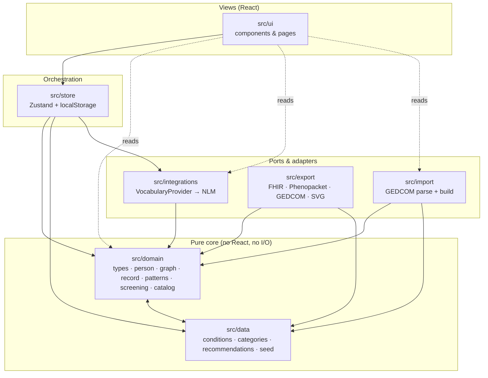

# Stemma — Architecture

This is the authoritative architecture reference for Stemma. It explains the layered design, the
"Person is the atom" data model, the kinship and hereditary-pattern engines, the two-layer condition
catalog, the local-first storage decision, and the key trade-offs — closing with an ADR-style
decision log.

The product vision behind these choices is
[`prototype/uploads/Lineage-expansion-ideation.md`](../prototype/uploads/Lineage-expansion-ideation.md)
(referred to below as "the ideation doc"; its section numbers, e.g. **§2**, are mirrored by
[`ROADMAP.md`](ROADMAP.md)).

## 1. What Stemma is — and the boundary it holds

Stemma is **decision support, not a diagnostic device.** It records a family's health history and
surfaces hereditary patterns worth a clinician's attention. Two boundaries are architectural, not
cosmetic, and are enforced in the domain layer:

- It **detects published red-flag patterns and cites the criterion met** — it does **not** compute a
  risk number (see [§5](#5-the-hereditary-pattern-engine) and [ADR-004](#adr-004--detect-patterns-do-not-manufacture-a-risk-number)).
- All output is **advisory / referral-oriented** — prompts to take to a professional, never a
  diagnosis or instruction.

## 2. Layered architecture

Stemma is a layered, local-first single-page app. Dependencies point **inward**: the domain core
knows nothing about React, storage, or the network; outer layers orchestrate the core.



| Layer | Directory | Responsibility | Depends on |
| --- | --- | --- | --- |
| **Domain** | `src/domain/` | Pure, typed, tested engine: model, kinship math, pattern detection, screening, catalog search | itself + curated `data` tables |
| **Data** | `src/data/` | Curated, pure constants (catalog, categories, recommendations, seed family) | `domain` (types only) |
| **Integrations** | `src/integrations/` | Ports to external services (the vocabulary adapter) | `domain` (types) |
| **Export** | `src/export/` | Serialize the graph to open standards | `domain`, `data` |
| **Import** | `src/import/` | Parse an external file into the graph (the inverse of Export) | `domain`, `data` |
| **Store** | `src/store/` | Zustand state, mutations, `localStorage` persistence, catalog assembly | `domain`, `data`, `integrations` |
| **UI** | `src/ui/` | React views over the store | everything below |

> **Current state.** All layers are implemented; the domain, store, export, import, and view layers
> are covered by the test suite (229 tests). The `@/` path alias maps to `src/` (see `vite.config.ts`
> / `tsconfig.app.json`).

The pure core is genuinely pure: `src/domain` imports no React, performs no I/O (`fetch`,
`localStorage`, timers), and imports nothing from `store`/`ui`/`integrations`. The only cross-layer
value it reads is the curated `RECS` table from `src/data/recommendations.ts` (a constant, not I/O).
`src/data` types itself against `src/domain` but holds no logic — hence the two are drawn as one
mutually-referencing pure core.

## 3. Data model — Person is the atom

The foundational decision (ideation **§1**) is that the **Person is the core entity, not the
proband.** Every surface — pedigree, patterns, timeline, screening — is a *view* over one graph:
people, the typed relationship edges between them (`Union`), the conditions each person carries, and
their timeline events. This is what lets every relative carry their own conditions and onset ages,
and lets any computation be **re-rooted on any person** in the record.

The model lives in [`src/domain/types.ts`](../src/domain/types.ts):

```ts
interface Person {
  id: string;
  name: string;
  sab: 'm' | 'f' | 'u';          // sex assigned at birth — drives genetics + geometry
  gender: 'man' | 'woman' | 'nb'; // gender identity — drives display only
  pronouns?: string;
  organs?: Organ[];               // explicit organ inventory; else derived from `sab`
  gen: number;                    // generation index (lower = older)
  x: number;                      // horizontal layout hint
  dead: boolean;
  birth: number | null;
  death: number | null;
  conds: ConditionEntry[];        // { id, onset: number | null, prov: 'self'|'record'|'death' }
  isProband?: boolean;
}

interface Union {                 // a typed relationship edge
  parents: string[];
  children: string[];
  consanguineous?: boolean;       // blood-related partners — changes recessive risk
}

interface TimelineEvent {         // one dated event owned by a person
  id: string; person: string; year: number;
  type: 'immunization'|'visit'|'lab'|'diagnosis'|'medication'|'screening'|'procedure'|'genetic';
  title: string; detail: string;
}

interface FamilyRecord {          // the single graph every view reads
  people: Person[];
  unions: Union[];
  timeline: TimelineEvent[];
  probandId: string;
}
```

### Gender-inclusive by construction (2022 NSGC)

Per the 2022 NSGC standard (ideation **§5**), Stemma separates three concerns that legacy pedigree
tools conflate:

| Concern | Field | Drives |
| --- | --- | --- |
| Sex assigned at birth | `sab` | Genetics and pedigree geometry |
| Gender identity | `gender` (+ `pronouns`) | Display: symbol and relationship label |
| Anatomy present | `organs` (or derived) | Screening recommendations |

The clinical payoff falls out of the model: screening is keyed off the **organ inventory**, not
gender — a trans man may still need cervical screening, a trans woman prostate screening. When
`organs` is omitted, `defaultOrgans(sab)` supplies a default set; set it explicitly to model
surgical history. The seed family's `ray` (AFAB, gender man, explicit `['ovaries','uterus','cervix']`
inventory) exercises exactly this path — and is labeled an *uncle*, not an aunt, because the label
follows gender identity while the geometry follows `sab`.

## 4. Kinship and the coefficient of relatedness

All family-graph queries and kinship math live in [`src/domain/graph.ts`](../src/domain/graph.ts) and
are pure over a `FamilyRecord`. `relationInfo(idx, id, rootId)` computes the relationship of any
person to any vantage `rootId`:

1. Collect the ancestors of both `id` and `rootId` with their shortest generational distance
   (`ancestors`, a shortest-distance DFS so multiple paths collapse to the closest).
2. Find the **most-recent common ancestors** (MRCAs): common ancestors none of whose children are
   also common.
3. Sum a **coefficient of relatedness** `r = Σ 0.5^(depth_root(a) + depth_id(a))` over the MRCAs —
   the probability of sharing a given allele IBD.
4. **Bin** `r` into a degree: `r ≥ 0.4 → 1st`, `≥ 0.2 → 2nd`, `≥ 0.09 → 3rd`, else non-blood
   (`null`).
5. Derive the side (`Paternal`/`Maternal`, from the root's own father/mother ancestor sets) and a
   human-readable label from the generation delta and the person's gender identity.

Because the vantage is a parameter, risk and screening can be recomputed from any member's point of
view within one record (`store.riskRoot`). `computeLayout` / `segments` in the same module turn the
graph into a generation-banded pedigree layout whose connector lines follow the standardized (2022
NSGC / Bennett) conventions: a **relationship line** between partners, a **sibship line** that spans
*only* a union's own children, and a **line of descent** from the relationship midpoint (or, for a
partner not in the record, straight from the single parent). That descent is a plain vertical when it
sits above the sibship and a lane-separated orthogonal jog when the sibship is pushed off-centre, so
two unions' lines never merge — a half-sibling never reads as the visible couple's child.

## 5. The hereditary-pattern engine

[`src/domain/patterns.ts`](../src/domain/patterns.ts) is Stemma's core value. `detectPatterns(record,
catalog, rootId, asOfYear)` walks the blood relatives of `rootId` and emits `PatternFlag`s, each
carrying a `severity`, the **specific `criterion` met**, an **advisory `rec`**, and the contributing
relatives. Flags sort most-actionable first (`referral` → `discuss` → `note`).

| Pattern | Trigger (summary) | Severity |
| --- | --- | --- |
| Hereditary breast & ovarian cancer (HBOC) | ≥2 breast ca on the **same lineage** (NCCN per-side), and/or ovarian ca, and/or breast ca < 50 | referral (discuss if the sides aren't recorded) |
| Lynch syndrome (colorectal & spectrum) | colorectal < 50, or ≥2 Lynch-spectrum cancers (colorectal / endometrial / gastric / ovarian / upper-urinary-tract) | referral |
| Premature cardiovascular disease | coronary disease in a 1st-degree relative (M<55/F<65), or cholesterol clustering with CAD | referral / discuss |
| Autosomal-dominant vertical transmission | a dominant-pattern condition across ≥2 generations or in a 1st-degree relative | referral / discuss |
| Age-of-onset proximity | vantage age approaches the earliest family onset of a condition they don't yet have | discuss |
| Limited family history | fewer than 4 blood relatives on record | note |

A second surface, `familyFindings`, produces the per-condition "Family Patterns" table, banding each
condition (`Diagnosed` / `Clustered` / `Close family` / `In family`) and attaching a curated or
generic advisory line.

### The "no manufactured number" boundary

The prototype computed `RR = 1 + (Σ degree-weights) × sensitivity`. That was retired deliberately
(ideation **§2**): a bare multiplier ignores base rate, inheritance pattern, family size, and age,
and "2× a 0.5% risk" reads as authoritative while being noise. Stemma instead **states the criterion
met** and, where a real number is warranted, points at a **validated external calculator** rather
than inventing one. `src/domain/screening.ts` encodes those pointers (`CALCULATOR_DEFS`: CanRisk /
BOADICEA, PREMM5 / Amsterdam II, ASCVD / FH) and is explicit that they are external tools "not wired
into the static build." See [ADR-004](#adr-004--detect-patterns-do-not-manufacture-a-risk-number).

## 6. The two-layer catalog and the vocabulary port

A condition is either **curated** (the engine understands it) or **long-tail** (a raw ICD-10 code),
and the app is never limited to the curated set.

### Curated layer
[`src/data/conditions.ts`](../src/data/conditions.ts) holds **116 curated conditions**, each with the
value-add metadata the engine reasons on (`cat`, `pattern`, `base` prevalence, `syn` synonyms) plus
baked-in ICD-10-CM and SNOMED CT codes (**72** coded) and **32 HPO** terms for the genetics audience.
It is **generated** by [`scripts/gen-conditions.mjs`](../scripts/gen-conditions.mjs) from the base
catalog (`scripts/conditions.source.json`) and its verified code + epidemiology maps, and carries a
`DO NOT EDIT BY HAND` banner — regenerate with `npm run gen:conditions`. The high-signal set's
prevalence is bound to sourced epidemiology (CDC / SEER / NHANES / AHA / IHME) with a `prevSource`
citation and a cited heritability (`herit`); the long tail stays illustrative until later passes
(ideation **§3**). `base` and `herit` are catalog metadata only — never rendered as a person's risk
(the "no manufactured number" boundary applies to heritability just as to risk).

### Long-tail layer — the vocabulary port
The ~74,000-code ICD-10-CM long tail is reached at runtime through a **port**,
[`src/integrations/vocabulary.ts`](../src/integrations/vocabulary.ts):

```ts
interface VocabularyProvider {
  readonly name: string;   // shown in the UI
  readonly system: string; // e.g. 'ICD-10-CM'
  search(query: string, opts?: VocabularySearchOptions): Promise<VocabularyHit[]>;
}
// VocabularyHit = { code: string; name: string; system: string }
```

The default `NlmClinicalTablesProvider` calls the **NLM Clinical Table Search Service**. That choice
is what keeps Stemma a **backend-free static site**: the NLM endpoint is **CORS-enabled and needs no
API key**, so long-tail lookup works directly from the browser on GitHub Pages — no server, no proxy,
no secret to leak. A hit is turned into a generic `Condition` via `hitToCondition` and attached to a
person like any curated one; `catalog.get()` resolves curated and long-tail ids uniformly (unknown
ids fall back to a generic record), so the rest of the engine treats them the same.

Because the provider is a port, a self-hosted deployment can implement the same interface against a
fuller terminology server (SNOMED/UMLS, a FHIR `$expand`) without touching the domain or UI (ideation
**§3**).

The store assembles the working catalog by merging the curated list with the user's long-tail
extensions: `buildCatalog(extensions)` → `createCatalog([...CONDITIONS, ...extensions], …)` in
[`src/domain/catalog.ts`](../src/domain/catalog.ts).

## 7. Local-first storage — and the pluggable future

Stemma is **local-first** (ideation **§8**, "storage adapter #1"). The Zustand store
([`src/store/useStore.ts`](../src/store/useStore.ts)) persists via `zustand/middleware`'s `persist` to
`localStorage` under the key `stemma-record`. Persistence is **partialized** to the durable data —
the `FamilyRecord`, long-tail catalog `extensions`, and `palette` — while transient UI state (current
view, selection, vantage) is deliberately not persisted. Mutations clone the record
(`structuredClone`) and set immutably. On hydrate, a `merge`/`migrate` guard validates the persisted
blob's shape and falls back to a clean seed if it is corrupt or schema-outdated, so the durable asset
can't hydrate garbage into state.

This is the cleanest privacy story: the record never leaves the browser, and the only runtime network
call is the optional NLM vocabulary lookup. **Caveat — unencrypted at rest:** because it lives in
`localStorage`, the record is stored in plaintext in the browser profile (readable with device/profile
access or by a malicious extension). At-rest encryption is deferred to the roadmap's storage adapter #2
(end-to-end-encrypted, zero-knowledge); the local build's threat model assumes a trusted device. The ideation doc's **§8** describes the intended
evolution — a **pluggable storage/sync layer** with a second adapter (a self-hosted, end-to-end
encrypted, per-person-vault API) behind the *same* UI and export layer, so moving between a
GitHub-Pages local build and a self-hosted deployment is not a rewrite. Today only the local adapter
exists (implicitly, as the `persist` config); factoring it behind an explicit interface is roadmap
work.

## 8. The export layer

No lock-in is treated as an ethical requirement for a personal health record (ideation **§4** / **§9**):
the same graph exports to open standards so it outlives the app. The `src/export/` layer reads a
`FamilyRecord` (+ catalog) and emits — entirely client-side:

- **HL7 FHIR R4** bundles (`Patient`, `Condition`, `FamilyMemberHistory`), dual-coded with SNOMED CT
  and ICD-10-CM, for portals/EHRs;
- **GA4GH Phenopackets v2** for genetic counselors and research;
- **GEDCOM 5.5.1** for genealogy interchange — round-trippable, since `src/import/` (below) reads
  it back;
- a **three-generation pedigree SVG** in 2022 NSGC nomenclature.

Like every layer below the store, export modules must be pure and deterministic (see
[§10](#10-determinism)) and depend only on `domain`/`data`.

## 9. The import layer

Phase 3 of the roadmap ("kill the retyping") added `src/import/`, the inverse of `src/export/` and
built to the same contract: it depends only on `domain`/`data`, never `store`/`ui`, and is pure and
deterministic — no clock, no random ids, no network — so a file dropped in by a user is parsed
entirely client-side.

[`src/import/gedcom.ts`](../src/import/gedcom.ts) exposes two functions (re-exported from
`src/import/index.ts`):

- **`parseGedcom(text)`** — a tolerant, hand-written GEDCOM 5.5.1 parser (no new runtime dependency).
  It builds the level-nested record tree, then reads `INDI` records into structural individuals
  (`NAME` with the `/surname/` slashes cleaned, `SEX`→`sab`, `BIRT`/`DEAT` year extracted from
  whichever GEDCOM date form is present) and `FAM` records into parent/child families. It never
  throws — a BOM, CRLF/CR line endings, dangling family links, duplicate cross-references, and an
  empty file all degrade to `warnings` surfaced to the user rather than a failure.
- **`buildRecordFromGedcom(parsed, probandId?)`** — maps the parsed structure to a `FamilyRecord`,
  or `null` when there is nothing to import. GEDCOM has no concept of "the record owner," so the
  caller supplies `probandId`; the UI ([`GedcomImport.tsx`](../src/ui/components/GedcomImport.tsx))
  asks "which of these is you?" and defaults to the first individual in the file.

**Scope is deliberately structural, not clinical.** Only people (name, `sab`, birth/death years) and
the union graph import — every person is built with `conds: []`. A genealogy export carries no
structured health data, and inferring conditions from free-text `NOTE`s would misattribute clinical
facts to a person who never entered them, so conditions are always added in Stemma after import.
`SEX` maps to `sab` (genetics/geometry); the display `gender` is *defaulted* from `sab` via
`genderFromSab` and stays freely editable per person afterwards — the same 2022 NSGC
genetics/identity split the rest of the model holds to (see [§3](#3-data-model--person-is-the-atom)).
Because the graph is **genetic** parentage, a step / adopted / foster relationship is not imported as
a parent edge — otherwise a step-parent would surface as a blood relative in the kinship math. This is
resolved **per parent**: Ancestry's `_FREL` (to father) / `_MREL` (to mother) and the standard
child-level `PEDI` (from either the `CHIL` sub-tag or the individual's `FAMC`) are each read, so a
child who is step to one parent but biological to the other keeps only the biological edge — a `FAM`
can therefore yield the couple's union plus a single-parent union for that child. Ancestry's
non-committal `unknown` is treated as genetic (its default for an unspecified-but-biological link).

GEDCOM also carries no layout, so two new domain functions in
[`src/domain/record.ts`](../src/domain/record.ts) derive one from the graph alone:

- **`deriveGenerations(people, unions)`** — assigns a generation index to every person with a
  cycle-safe, signed-delta breadth-first search (a child is one generation below each parent,
  partners and siblings share a generation), normalized so the oldest generation present is `0`.
  First assignment wins, so a contradictory cycle in malformed data degrades gracefully instead of
  looping.
- **`layoutFromGraph(record)`** — assigns `gen` (via `deriveGenerations`) and a _seed_ `x` per
  person, ordering each generation by the barycentre of its already-placed parents. `gen` is
  authoritative and used throughout the app; the `x` is only a starting order. The real horizontal
  placement lives at render time in **`computeLayout`** ([`src/domain/graph.ts`](../src/domain/graph.ts)):
  it bands by the authoritative `gen`, then runs a barycentre ordering pass (keeping couples adjacent)
  and an isotonic-regression coordinate pass so children sit centred under their parents and partners
  sit side by side. Doing the placement at render time fixes every record source uniformly — the
  hand-authored seed, `layoutFromGraph`'s import output, and `linkRelative`'s local guesses all carry
  only a partial `x` hint. `computeLayout` never re-derives `gen`, and its output is a `useMemo`-cached
  view value that is never written back into the durable record.

Because an imported record is the first thing fed to the store from outside its own trusted
mutation path, `store.replaceRecord` now validates it against `isValidRecord` (moved to
`src/domain/record.ts`) before swapping it in, rejecting a malformed record rather than hydrating
garbage into state — the same guard `localStorage` hydration already applied. See
[ADR-008](#adr-008--gedcom-import-is-structural-only-via-a-new-import-layer).

## 10. Determinism

The engine is deterministic so it can be unit-tested against known pedigrees. The one source of
non-determinism — the current date — is **injected, never read** inside the domain:

- Any domain function that reasons about age takes an explicit **`asOfYear`** parameter
  (`detectPatterns(…, asOfYear)`, `ageOf(person, asOfYear)`); timeline events carry explicit years.
- The **wall-clock binding lives only in the store**: `CURRENT_YEAR = new Date().getFullYear()`,
  passed in at call time.
- **Tests pass fixed values** (`const AS_OF = 2026`) and assert against them — never against
  `new Date()`. See [`patterns.test.ts`](../src/domain/patterns.test.ts) and
  [`graph.test.ts`](../src/domain/graph.test.ts).

Tests are Vitest + Testing Library (jsdom), co-located as `*.test.ts`, and generally use the seed
family in [`src/data/seed.ts`](../src/data/seed.ts) as their fixture (`npm run test` / `test:run`).

## 11. Decisions (ADR log)

Lightweight architecture decision records. Each: context → decision → consequence.

### ADR-001 — React 18 + Vite 5 + TypeScript (strict)
**Context:** productionalizing a single-file prototype into a maintainable static SPA.
**Decision:** React 18 + TypeScript in `strict` mode, built with Vite 5; ESLint 9 flat config +
Prettier; Vitest for tests. **Consequence:** fast dev/build, a typed model that documents itself, and
a single quality gate (`npm run check`). `verbatimModuleSyntax` mandates `import type`; `base` is set
to `/stemma/` for GitHub Pages builds.

### ADR-002 — Zustand for state, local-first persistence
**Context:** one family record, re-rootable views, no backend. **Decision:** a single Zustand store
with `persist` to `localStorage`, partialized to durable data. **Consequence:** minimal boilerplate,
trivial persistence, and a clean privacy story — at the cost of `localStorage`'s size/quota limits,
which the pluggable storage layer (ideation §8) will address (IndexedDB/OPFS, or a self-hosted vault).

### ADR-003 — Local-first, no backend (yet)
**Context:** a family health record is sensitive; the simplest trustworthy deployment is one that
cannot leak. **Decision:** ship a static site whose data never leaves the browser; the only runtime
network call is the optional, key-less, CORS-safe NLM vocabulary lookup. **Consequence:** no server to
run, breach, or fund; interoperability and multi-device sync are deferred to the export layer and a
future encrypted self-hosted adapter (ideation §7–§8) behind the same UI.

### ADR-004 — Detect patterns, do not manufacture a risk number
**Context:** the prototype's homemade relative-risk multiplier ignored base rate, inheritance pattern,
family size, and age, yet read as authoritative. **Decision:** retire the number; detect published
red-flag patterns, cite the specific criterion met, and defer real quantification to validated
external calculators. **Consequence:** defensible, more clinically useful output and a clean liability
boundary; Stemma stays decision-*support*, not a diagnostic device. (ideation §2.) This is enforced as
a code-review invariant — see [`CONTRIBUTING.md`](../CONTRIBUTING.md).

### ADR-005 — Two-layer condition catalog with a vocabulary port
**Context:** a curated catalog rich enough for the engine to reason on, without capping the app at a
fixed list. **Decision:** a generated curated layer (116 conditions with category / inheritance /
sourced prevalence / codes) plus a runtime `VocabularyProvider` port (default: NLM Clinical Tables) for the
~74,000-code ICD-10 long tail. **Consequence:** high-signal reasoning where it matters, full ICD-10
coverage everywhere else, and no backend or API key required for the static build. The curated file is
generated (`npm run gen:conditions`), never hand-edited. (ideation §3.)

### ADR-006 — Person is the atom; gender-inclusive (2022 NSGC)
**Context:** the prototype blended a proband-centric risk tool with a personal tracker.
**Decision:** model the Person as the core entity and make every surface a view over one
people-and-unions graph; adopt the 2022 NSGC split of `sab` (genetics/geometry) / gender identity
(display) / organ inventory (screening). **Consequence:** every relative carries their own history,
computations re-root on any vantage, and screening is anatomy-correct for trans and nonbinary
individuals — a genuine differentiator. It is the one schema choice that is expensive to reverse, so
it was made first. (ideation §1, §5.)

### ADR-007 — Name: Stemma
**Context:** the prototype was codenamed **Lineage**. **Decision:** the productionalized project is
**Stemma** (repo `kabaka/stemma`), tagline *"Family health intelligence."* **Consequence:** a
*stemma* is a family tree / lineage diagram — fitting for a pedigree-first tool; the `Lineage`
prototype artifacts remain under `prototype/` as source material and are referenced (as `LINEAGE_*`)
by the catalog generator.

### ADR-008 — GEDCOM import is structural-only, via a new import layer
**Context:** Phase 3 ("kill the retyping") called for reusing an existing family tree instead of
retyping every relative. A GEDCOM file describes people and genealogical relationships; it has no
field for a health condition, and its free-text `NOTE`s are not structured clinical data — parsing
them into `Condition`s would mean guessing at a diagnosis from prose the engine cannot verify.
**Decision:** add `src/import/` as a new layer, the inverse of `src/export/` and bound to the same
contract (depends on `domain`/`data` only, pure, deterministic, no network). `parseGedcom` +
`buildRecordFromGedcom` import people and the parent/child graph only — every imported person gets
`conds: []`, and conditions are entered in Stemma afterward. GEDCOM's `SEX` sets `sab`; the display
`gender` defaults from it and stays editable, and GEDCOM's missing proband concept is resolved by
asking the user "which of these is you?" in the UI. Generations and layout, absent from GEDCOM
entirely, are derived from the union graph (`deriveGenerations`, `layoutFromGraph`). **Consequence:**
import can never fabricate a clinical fact — the guardrail in [§1](#1-what-stemma-is--and-the-boundary-it-holds)
holds for data entering the record, not just data the engine derives from it — at the cost of still
requiring manual condition entry after a GEDCOM import. `store.replaceRecord`, the first action fed an
externally-built record, now validates against `isValidRecord` rather than trusting the shape, closing
the same hydration hole a corrupt `localStorage` blob already guarded against. (roadmap Phase 3.)

---

_See also:_ [`README.md`](../README.md) · [`CONTRIBUTING.md`](../CONTRIBUTING.md) ·
[`ROADMAP.md`](ROADMAP.md) · the product vision in
[`prototype/uploads/Lineage-expansion-ideation.md`](../prototype/uploads/Lineage-expansion-ideation.md).
